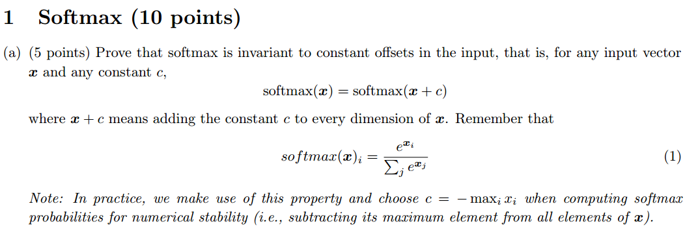
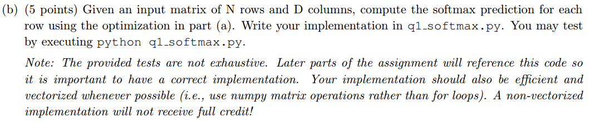
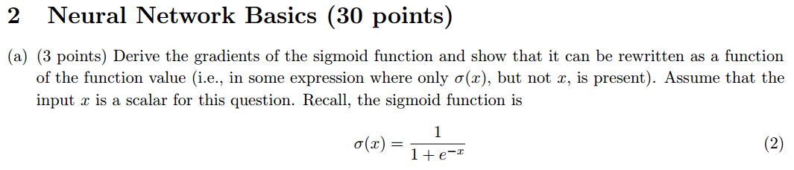
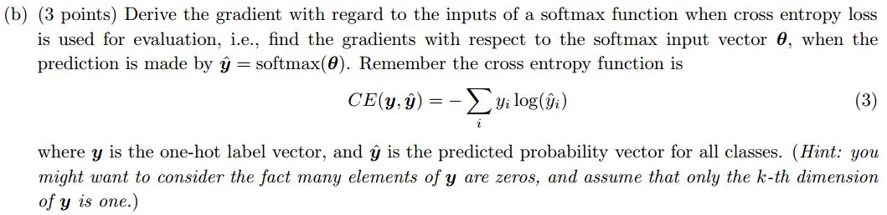
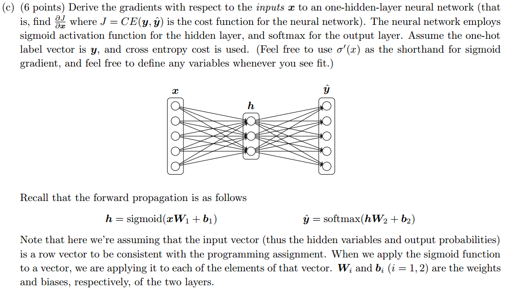
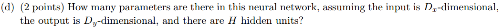
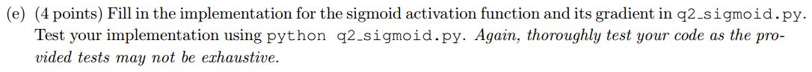
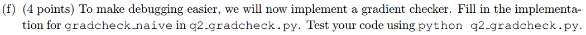
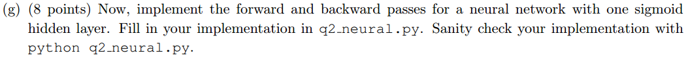

  

  
  
解答：

  
即  

  
证毕  

  

解答：  
直接在代码中利用numpy实现即可。注意要先从中减去每一行的最大值，这样在保证结果不变的情况下，所有的元素不大于0，不会出现`上溢出`，从而保证结果的正确性。具体可参考 http://www.hankcs.com/ml/computing-log-sum-exp.html  
  
   

解答：

  

即函数的求导可以由其本身来表示。

  

解答：  
我们知道真实标记是one-hot向量，因此我们下面的推导都基于  ,且  ，即真实标记是  .  

  

其中：  

  

接下来讨论  :  
1) :  

  

则：  

2) :  

  

则：  

  

综上：  

  

或者：

  

  

解答：  
首先设： 和 ，那么前向传播的顺序依次为：  

现在求,其实就是进行一次反向传播：  

  

解答：  
(1) 从输入层到隐藏层，全连接共个，即，加上个偏置项，共个。  
(2) 从隐藏层到输出层，共个。  
参数个数共：

  

  

  