<p align="center"></p>  
  
**所有的代码题目对应的代码可查看对应文件夹AssignmentX_Code下的.py文件**
  
  

**解：**
<p align="center"></p>  
即  
<p align="center"></p>  
证毕  

  

**解：**  
直接在代码中利用numpy实现即可。注意要先从中减去每一行的最大值，这样在保证结果不变的情况下，所有的元素不大于0，不会出现`上溢出`，从而保证结果的正确性。具体可参考 http://www.hankcs.com/ml/computing-log-sum-exp.html  
  
   

**解：**
<p align="center"></p>  

即函数的求导可以由其本身来表示。

  

**解：**  
我们知道真实标记是one-hot向量，因此我们下面的推导都基于  ,且  ，即真实标记是  .  

<p align="center"></p>  

其中：  
<p align="center"></p>  

接下来讨论  :  
1) :  
<p align="center"></p>  

则：  
<p align="center"></p>

2) :  
<p align="center"></p>  

则：  
<p align="center"></p>  

综上：  
<p align="center"></p>  

或者：

<p align="center"></p>  

  

**解：**  
首先设： 和 ，那么前向传播的顺序依次为：  

<p align="center"></p>
<p align="center"></p>
<p align="center"></p>
<p align="center"></p>
<p align="center"></p>

现在求其实就是进行一次反向传播：  
<p align="center"></p>
<p align="center"></p>
<p align="center"></p>
<p align="center"></p>

  

**解：**  
(1) 从输入层到隐藏层，全连接共个，即，加上个偏置项，共个。  
(2) 从隐藏层到输出层，共个。  
参数个数共：
<p align="center"></p>

  

  

  

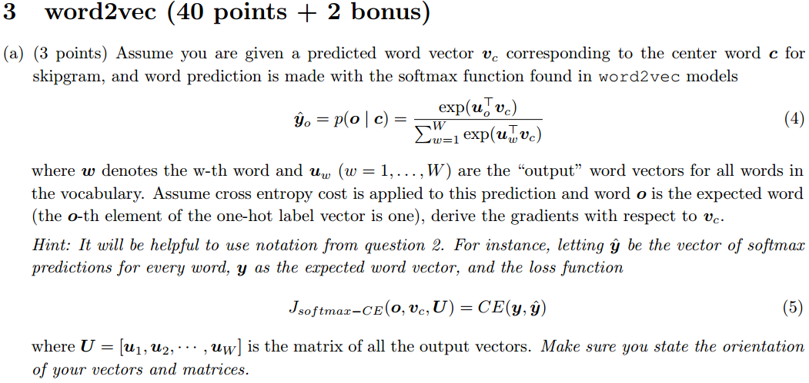  

**解：**  
首先分析各个量的形状：，，其中为词典大小，为词向量的维度。   
我们设：  
<p align="center"></p>  

则：  
<p align="center"></p>  
<p align="center"></p>  
那么：  
<p align="center"></p>  

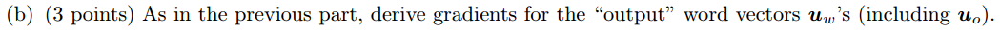  

**解：**  
可以先对求导：  
<p align="center"></p>  
  
那么对  求导的结果对上式转置即可：  

<p align="center"></p>  
也可以表示为：  
<p align="center"></p>  

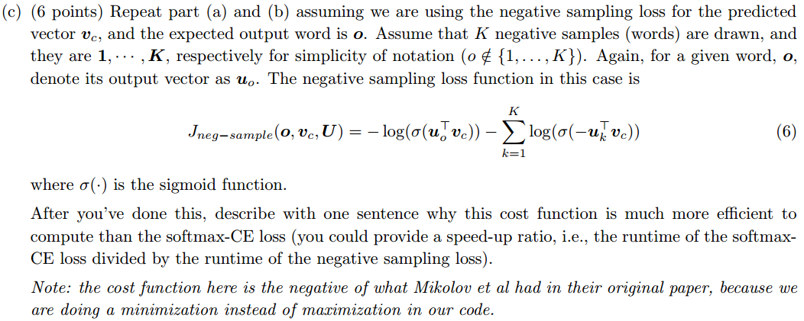  

**解：**  
首先应该知道：  
<p align="center"></p>  
<p align="center"></p>
已知：  
<p align="center"></p>  

直接求导即可：  
<p align="center"></p>  
<p align="center"></p>  

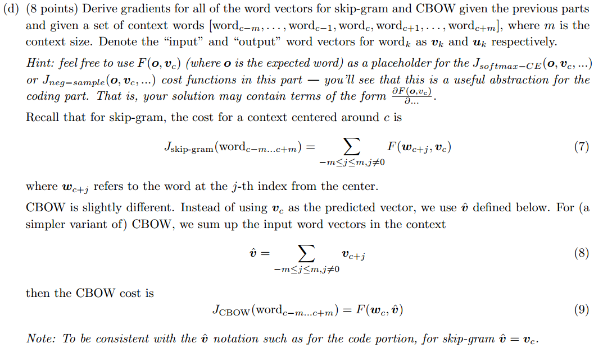

**解：**  
根据题目的提示可知，我们可以设为损失函数，等价于前面的或者，而对变量的求导我们前面已经做过，所以这里直接使用代替即可，不用再进一步求导展开。  
(1) **skip-gram模型**  
<p align="center"></p>
<p align="center"></p>  
<p align="center"></p>   
<p align="center"></p>   
   
\(2) **CBOW模型**  
因为CBOW模型是根据多个背景词预测一个中心词，又因为惩罚函数是形如`(一个词，一个词)`的形式，所以要把多个背景词变成一个词，那么一种有效的方式就是把这些背景词的词向量求平均便得到了一个词向量。  
<p align="center"></p>
<p align="center"></p>  
那么：  
<p align="center"></p>  
<p align="center"></p>  
<p align="center"></p>  

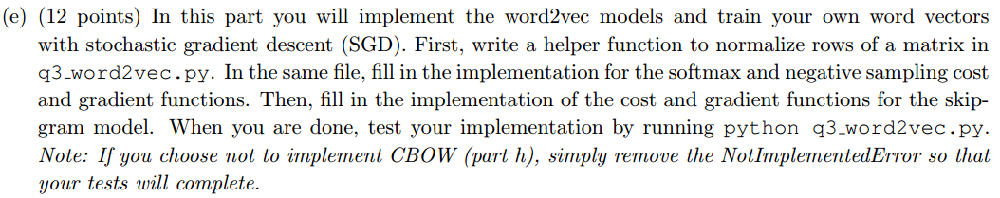  

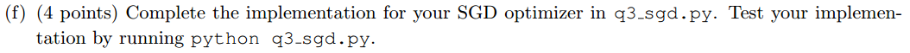  

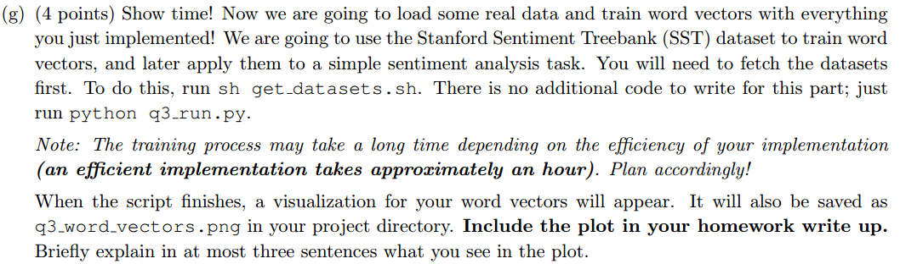  
**解：**   
我本地共训练了**5**+个小时。  
输出的结果为：  
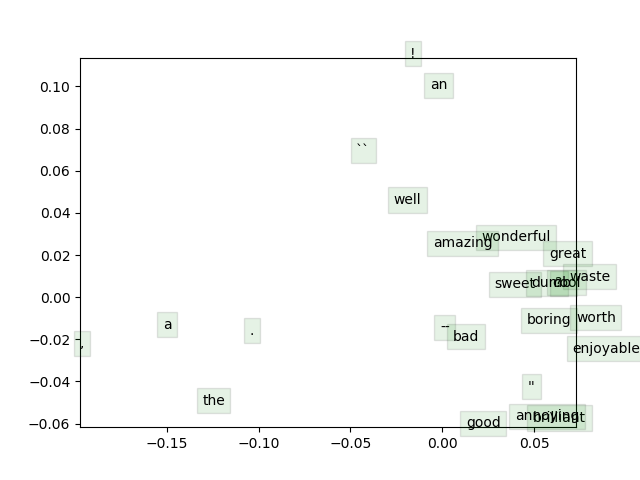
   

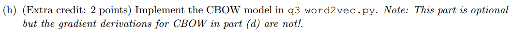  

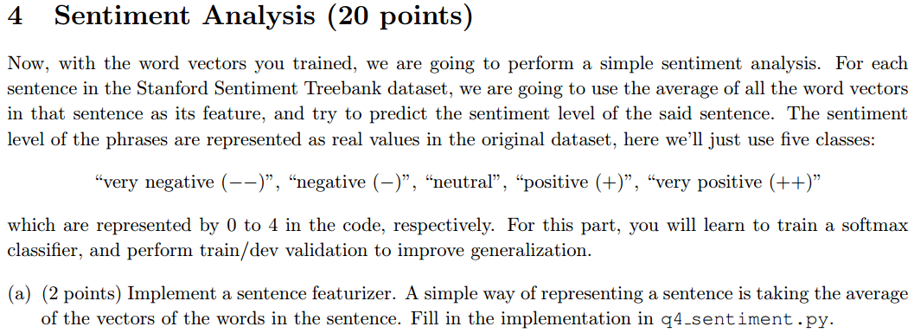  
**解：**
按题目要求实现即可。

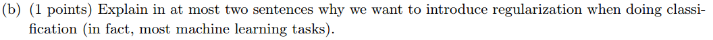  
**解：** 引入正则化可以降低模型复杂度，进而避免过拟合，以提升泛化能力。  

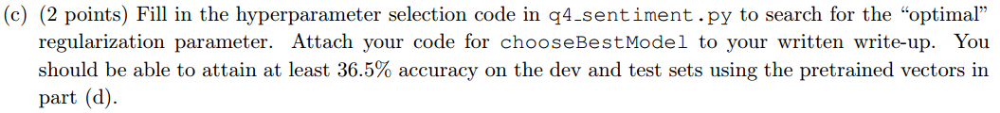  
**解：** 注意是按照模型的验证集准确率来选择最优模型。  

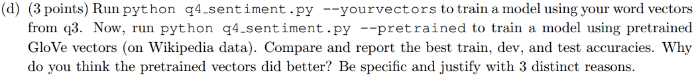  
**解：** 我的本地答案：  
(1) 使用自己训练的词向量的结果
```
Best regularization value: 7.05E-04
Test accuracy (%): 30.361991
dev accuracy (%): 32.698
```
  
(2) 使用预训练的词向量的结果
```
Best regularization value: 1.23E+01
Test accuracy (%): 37.556561
dev accuracy (%): 37148
```
使用预训练的词向量的效果更好的原因：
* 其数据量大。
* 训练充分。
* 其采用的为GloVe,该模型利用全局的信息。
* 维度高。

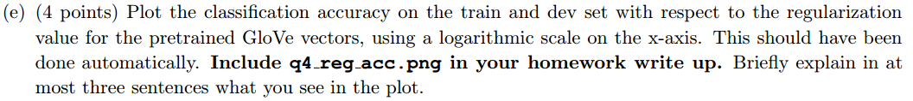  
**解：**  
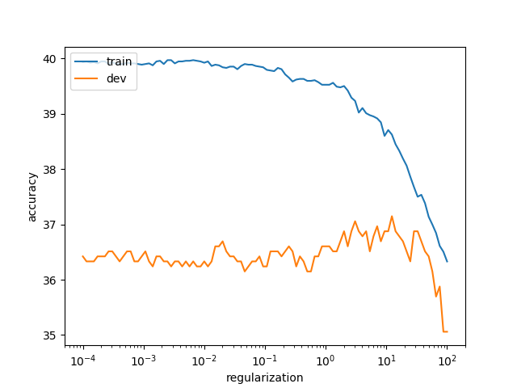   
解释：随着正则化因子的增大，最终所得的模型越简单，拟合能力差，出现欠拟合，导致两者的准确率下降。  

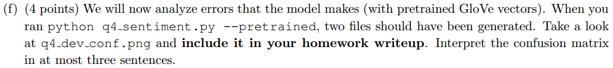  
**解：**  
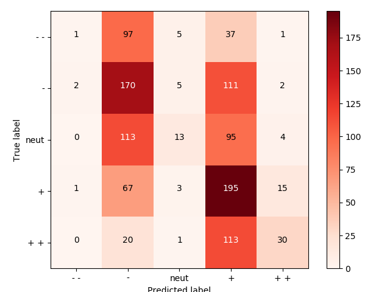  
  

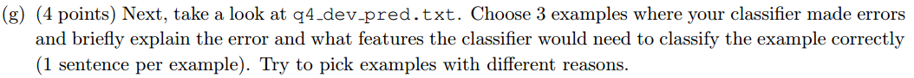  