<p align="center"></p>  

所有的代码题目对应的代码可查看对应文件夹Assignment2_Code下的.py文件  

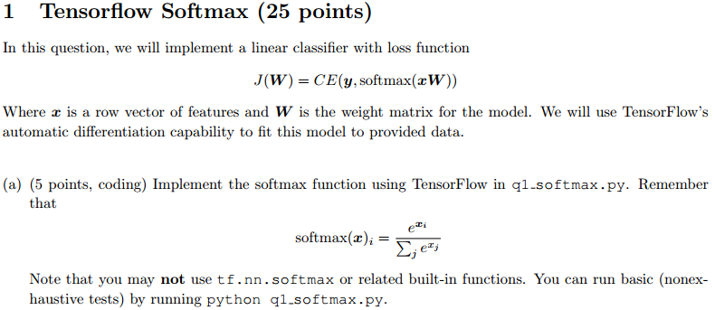

**解:**  
（提示使用keepdims参数会方便一些哦。  ）

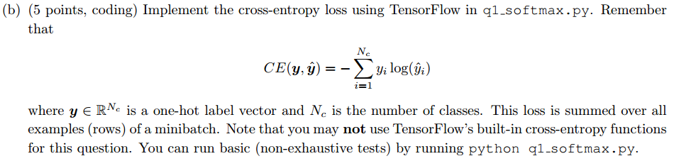

**解:**  
（积累知识：  
* tf.multiply()为元素级的乘法，要求形状相同。  
* tf.matmul()为矩阵乘法。  
两者都要求两个矩阵的元素类型必须相同。    

） 

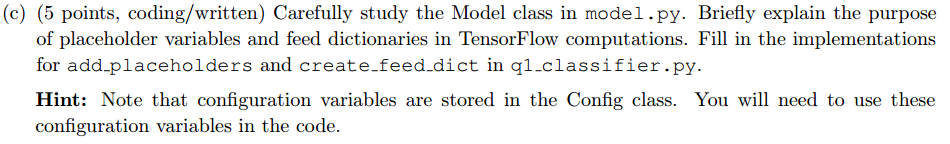  

**解:**  
占位符(placeholder)和feed_dict可以在运行时动态地向计算图“喂”数据。（TensorFlow采用的是静态图）  

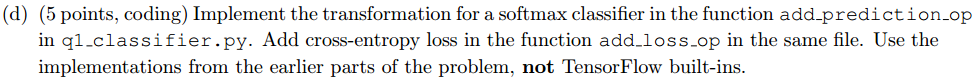  

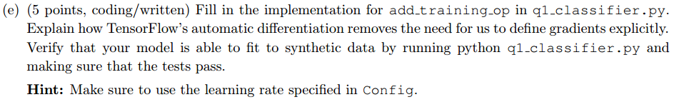  

**解:**  
TensorFlow的自动梯度，是指我们使用时只需要定义图的节点就好了，不用自己实现求解梯度，反向传播和求导由TensorFlow自动完成。  
  

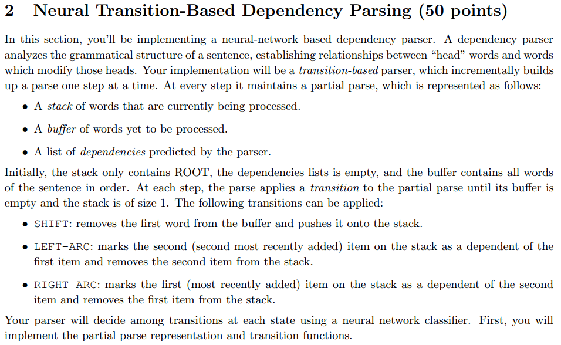  

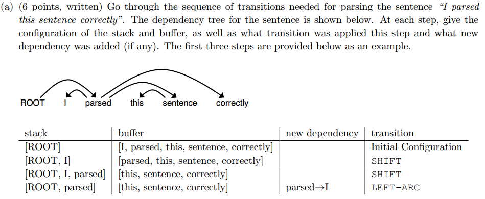  
**解：**  

|stack|buffer|new dependency|transition|
|-----|------|--------------|----------|
|[ROOT,parsed,this]|[sentence,correctly]| |SHIFT|
|[ROOT,parsed,this,sentence]|[correctly]| |SHIFT|
|[ROOT,parsed,sentence]|[correctly]|sentence -> this |LEFT-ARC|
|[ROOT,parsed]|[correctly]|parsed -> sentence |RIGHT-ARC|
|[ROOT,parsed,correctly]|[]| |SHIFT|
|[ROOT,parsed]|[]|parsed -> correctly |RIGHT-ARC|
|[ROOT]|[]|ROOT -> parsed |RIGHT-ARC|  
  

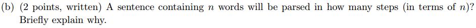  
**解：**  
共2n步  
* 每个词都要进入stack中，故要有n步SHIFT操作。  
* 最终stack中只剩ROOT，即每一次ARC会从stack中删掉一个词，故共有n步LEFT-ARC和RIGHT-ARC操作。  

   
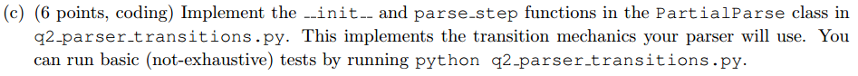  

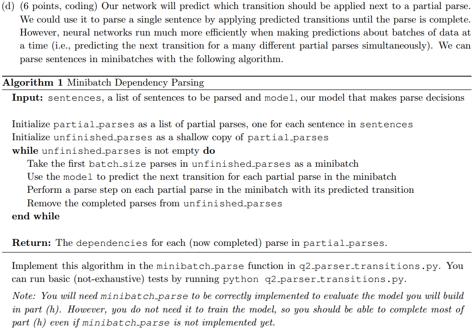  

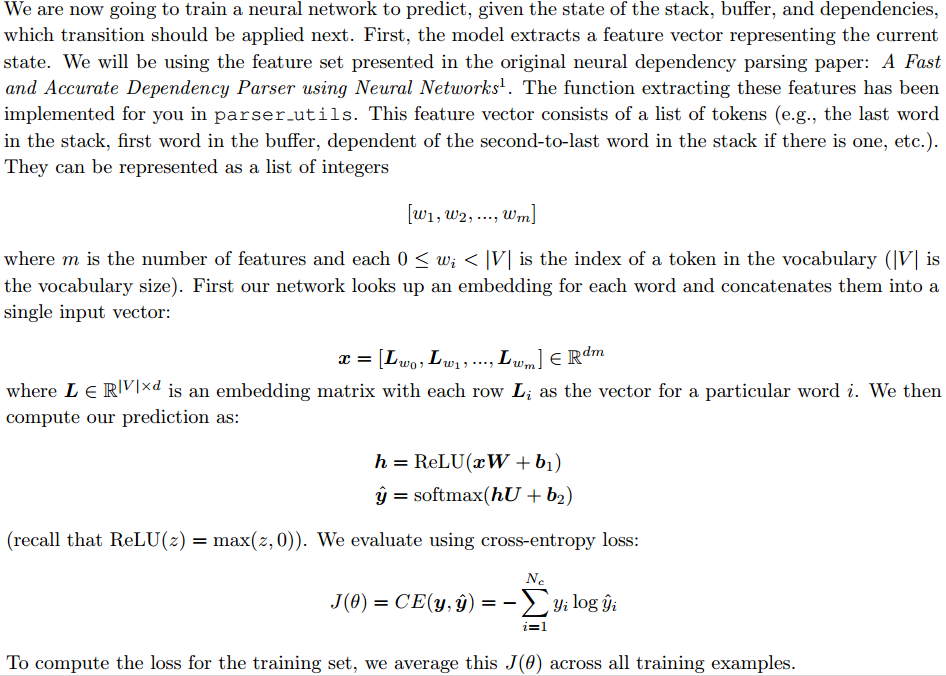  

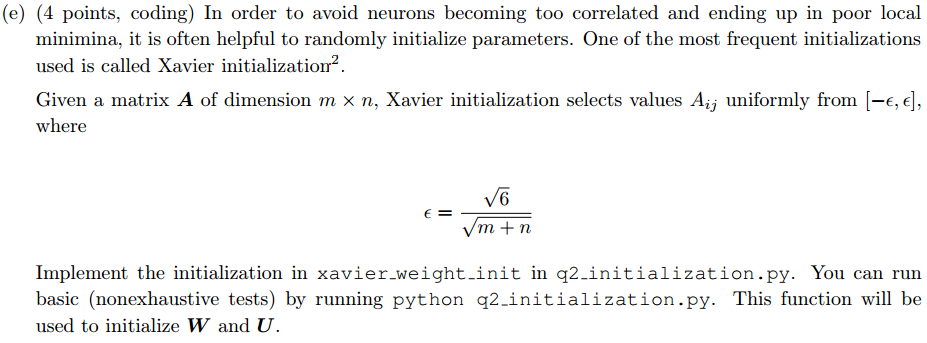

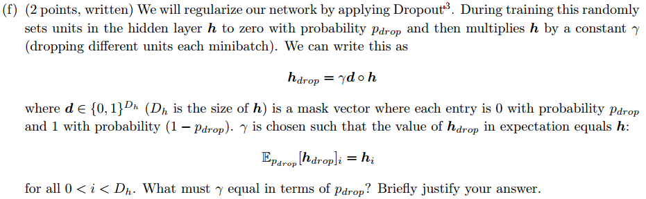
**解：**
<p align="center"></p>  
即推导出：  
<p align="center"></p>  

  

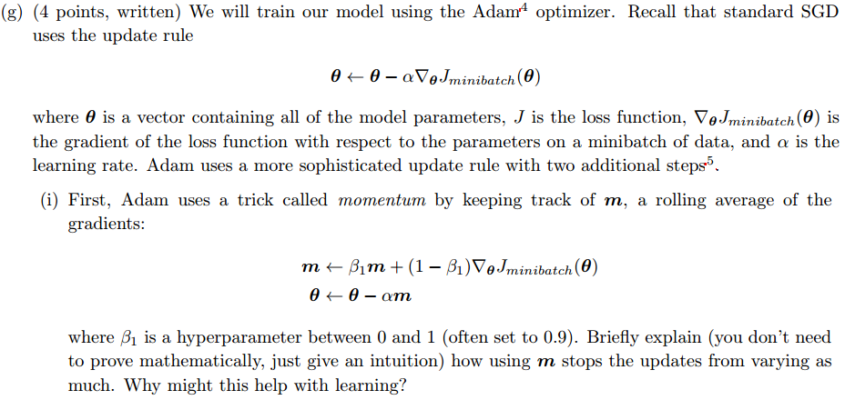  

**解:**  
因为其实是之前全部梯度(更新量)的加权平均，更能体现梯度的整体变化。因为这样减小了更新量的方差，避免了梯度振荡。  
一般要接近1。  

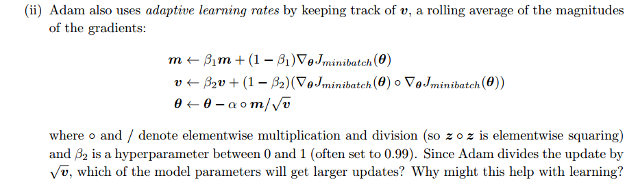  
**解：**  
* 更新量: 对梯度(更新量)进行滑动平均  
* 学习率: 对梯度的平方进行滑动平均  

梯度平均最小的参数的更新量最大，也就是说，在损失函数相对于它们的梯度很小的时候也能快速收敛。即在平缓的地方也能快递移动到最优解。  

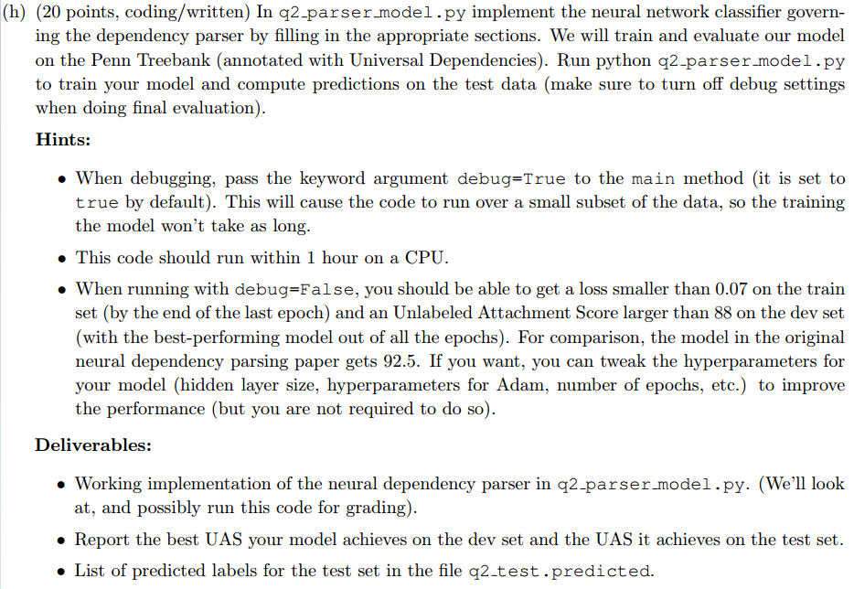  
**解：**  
我的结果为  
```
Epoch 10 out of 10
924/924 [============================>.] - ETA: 0s - train loss: 0.0654
Evaluating on dev set - dev UAS: 88.37
New best dev UAS! Saving model in ./data/weights/parser.weights

===========================================================================
TESTING
===========================================================================
Restoring the best model weights found on the dev set
Final evaluation on test set
- test UAS: 88.84
```
运行时间：15分钟。  


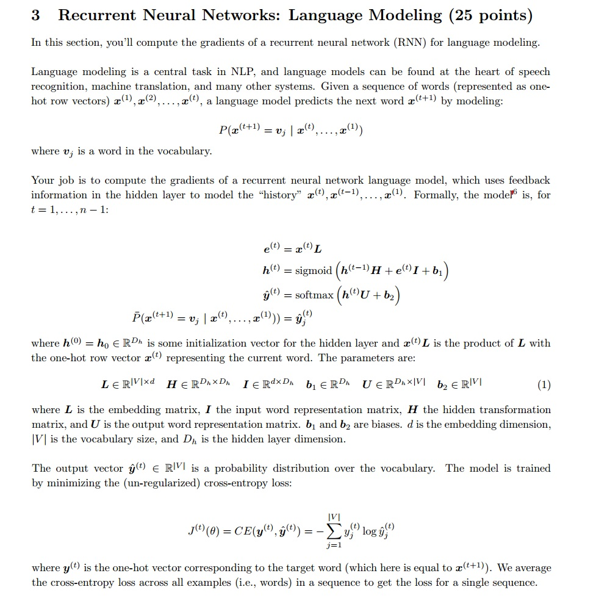
**题目解读**  
先明确题目中各个量的维度：  
由题目可知，是one-hot**行向量**，且**隐藏层也是行向量的形式**。  
则可得：  
<p align="center"></p>  
<p align="center"></p>  

是输出，即每个单词的概率分布(softmax之后)，那么：  
<p align="center"></p>  
然后我们就可以得到：  
<p align="center"></p>  
<p align="center"></p>  
<p align="center"></p>  
<p align="center"></p>  
<p align="center"></p>  
<p align="center"></p>  
<p align="center"></p>  

其中是词向量的长度，也就是代码中的。  
在清楚了上面各矩阵的维度之后的求导才会更清晰。  

因为句子的长度不一，然后损失函数是针对一个单词所计算的，然后求和之后是对整个句子的损失，故要对损失函数求平均以得到每个单词的平均损失才行。  

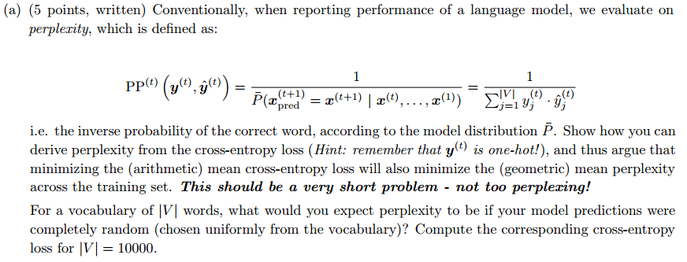  
**解：**  
由于标签是one-hot向量，假设的真实标记为  
则：  
<p align="center"></p>  
<p align="center"></p>  
很容易得出：  
<p align="center"></p>  

很常见的结论，一定要知道的。  

当时，随机选择能选对的概率为，(困惑度)为。。  

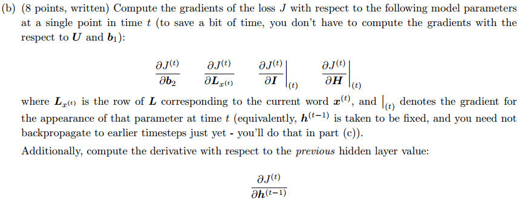  
**解：**  
根据题目可知：。  
现在设：  
<p align="center"></p>  
<p align="center"></p>  

则前向传播为：  
<p align="center"></p>  
<p align="center"></p>  
<p align="center"></p>  
<p align="center"></p>  
<p align="center"></p>  
<p align="center"></p>  

反向传播：  
中间值：  
<p align="center"></p>  
<p align="center"></p>  

则有：  
<p align="center"></p>  
<p align="center"></p>  

<p align="center"></p>  
<p align="center"></p>  

<p align="center"></p>  

**如果你对上面的反向传播中的求导有疑惑，那么请看下面的简单讲解**  

考虑如下求导：  
<p align="center"></p>  

假设除了，前面的已经求出了  
<p align="center"></p>  

现在就差了。需要讨论两种情况：  

1. 其中，是一个行向量乘上一个矩阵，然后对矩阵求导：  
<p align="center"></p>  

结果为 **左乘** 前面一坨的求导结果，即：  

<p align="center"></p>  

而具体到题目中就是：  
<p align="center"></p>  
<p align="center"></p>  
所以：  
<p align="center"></p>  

2. 其中，是一个行向量乘上一个矩阵，然后对行向量求导：  

<p align="center"></p>  

结果为 **右乘** 前面一坨的求导结果，即：  

<p align="center"></p>  

而具体到题目中就是：
<p align="center"></p>  


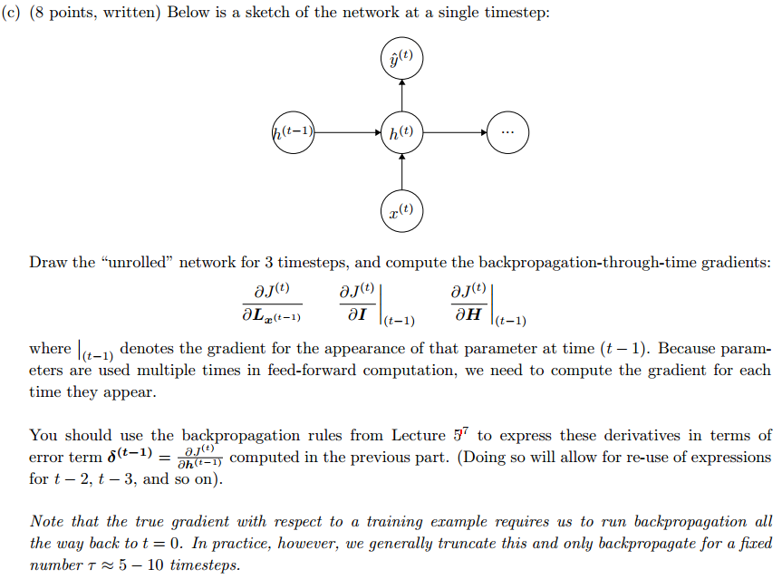
**解：**  
RNN的反向传播是按时间的反向传播，对于时间步的损失函数要沿时间向前传播，故现在为了方便，定义时间步的损失函数对每一时间步的误差项:  
<p align="center"></p>

现推导误差项的传播：  
<p align="center"></p>  
<p align="center"></p>  
<p align="center"></p>  
故可得递推式：  
<p align="center"></p>  
即可得：  
<p align="center"></p>  

<p align="center"></p>  

<p align="center"></p>  


注意，上述过程用到了 函数的导数:  
<p align="center"></p>  

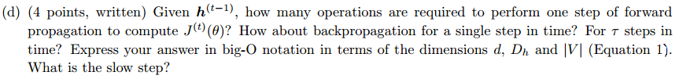  
前向传播的复杂度分别为：  
<p align="center"></p>  
<p align="center"></p>  
<p align="center"></p>  
<p align="center"></p>  
<p align="center"></p>  
<p align="center"></p>  
综上，在有两阶的时候则只保留两阶的情况下，前向传播的复杂度为：  

<p align="center"></p>  
同理，反向传播的复杂度为：  
<p align="center"></p>  

上述是第一个时间步长的复杂度，而个时间步的话就是：  

*  一次损失函数对的求导，复杂度为；
*  次反向传播，复杂度为;  
  
故，个时间步的反向传播复杂度为：  
<p align="center"></p>  

而如果是对前个词，每次都进行步的反向传播，那么复杂度大概为：  
<p align="center"></p>  

