<p align="center"></p>  

**所有的代码题目对应的代码可查看对应文件夹Assignment3_Code下的.py文件**  

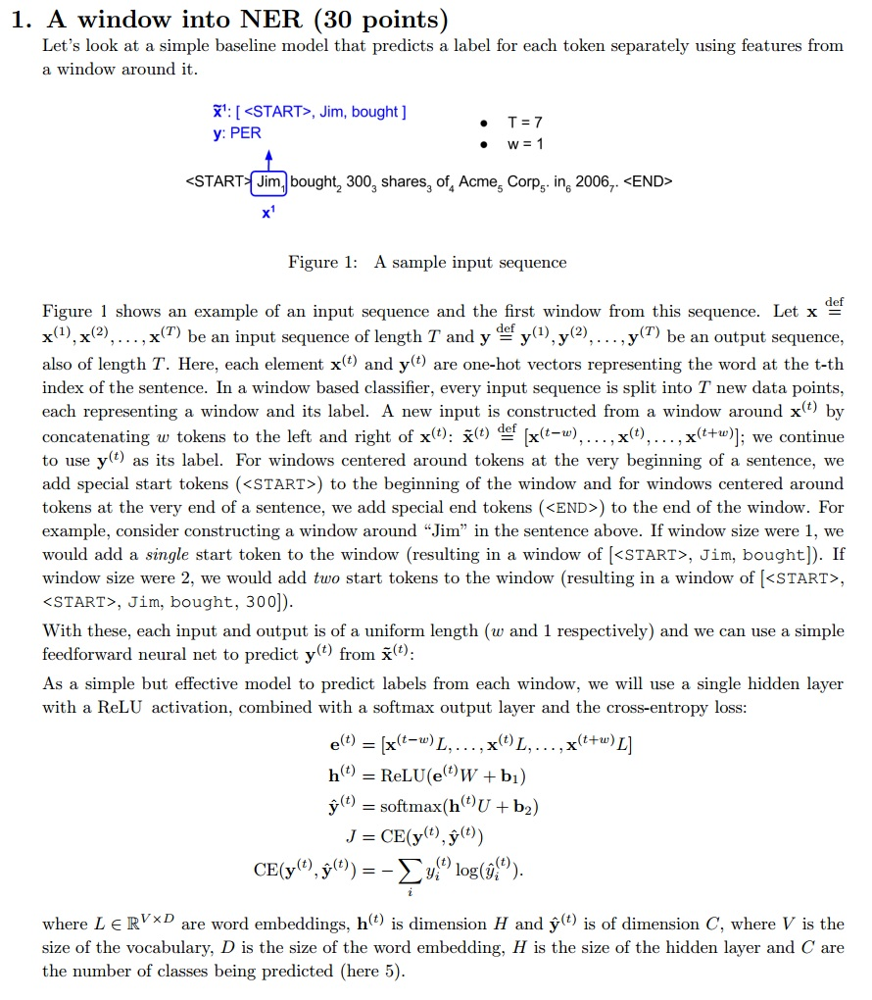  

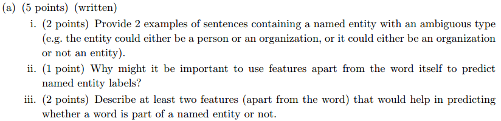  

**解：**  
ii) 只用词本身的话有点像基于统计的方法，面对低频词或者未统计词模型表现不好，有时候词也有二义性，无法确定是否为实体或者是什么实体。  
iii) 上下文、词性等。  


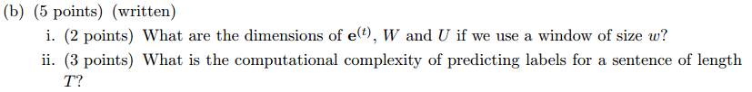  

**解：**  
i) 推算所有变量的形状：  

<p align="center"></p>  
<p align="center"></p>  
<p align="center"></p>  
<p align="center"></p>  
<p align="center"></p>  
<p align="center"></p>  
<p align="center"></p>  
<p align="center"></p>  
<p align="center"></p>  

ii) 对于1个word的复杂度为：  

<p align="center"></p>  
<p align="center"></p>  
<p align="center"></p>  
<p align="center"></p>  

所以复杂度为：    
长度为T的句子复杂度为：    

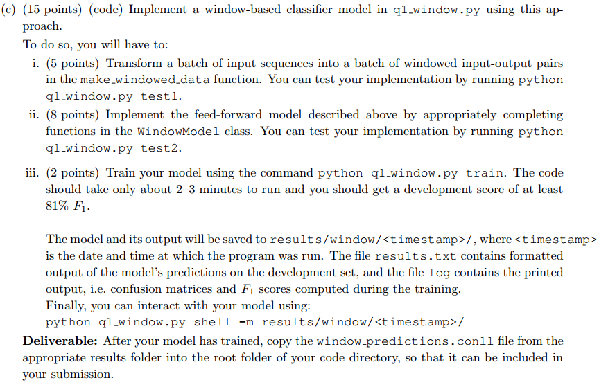  

**解：**  

在python3中利用`from io import StringIO`来导`StringIO`。

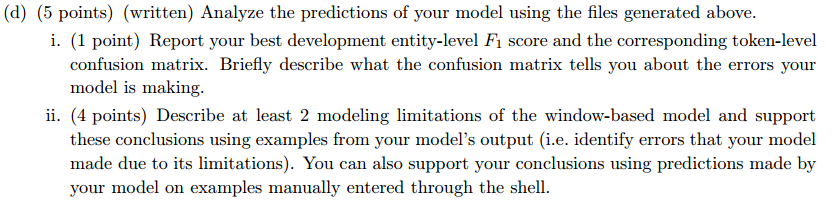  

 
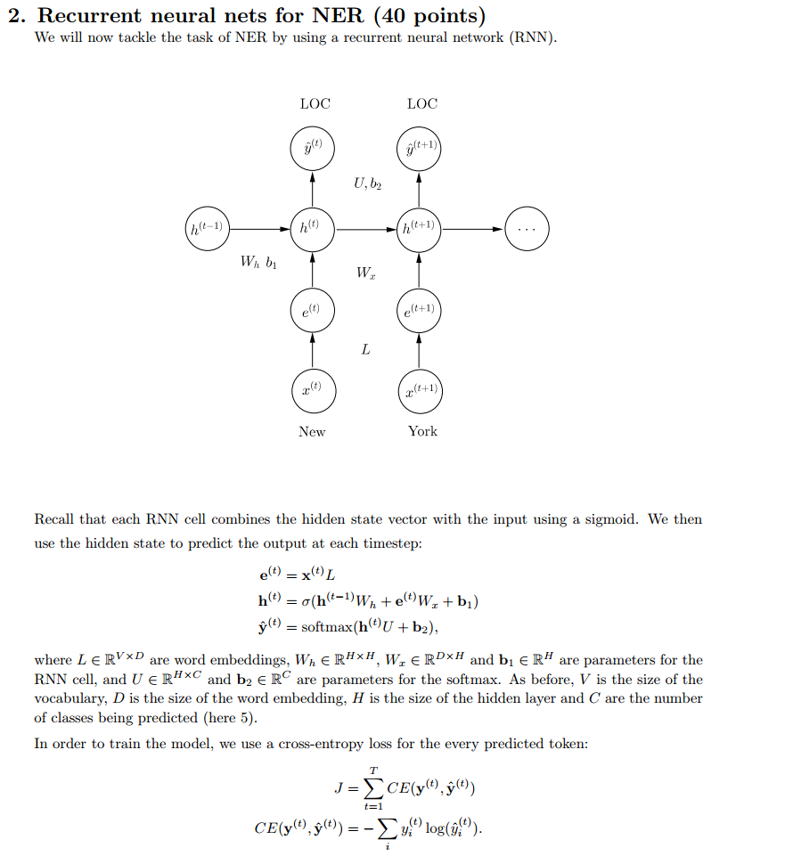  

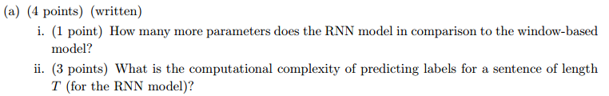  

**解：**

i) ① `window-based model`中的，而`RNN`中的;


② `RNN`多了个。


ii) .

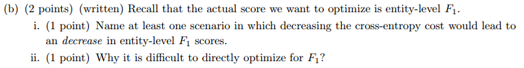  

**解：**
ii) ① 分数的意义理解起来不够明显、直接明了。

② 分数的计算需要整个语料库来计算，很难进行批训练和并行运算。

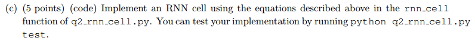 

```python
"""
__call__函数的含义：假设实例化了一个该类的对象instan,那么instan(inputs,state)其实就会
                    调用__call__()函数，这样在__call__()函数中实现前向传播，调用就很方便
"""
def __call__(self, inputs, state, scope=None):
    """Updates the state using the previous @state and @inputs.
    Remember the RNN equations are:

    h_t = sigmoid(x_t W_x + h_{t-1} W_h + b)

    TODO: In the code below, implement an RNN cell using @inputs
    (x_t above) and the state (h_{t-1} above).
        - Define W_x, W_h, b to be variables of the apporiate shape
            using the `tf.get_variable' functions. Make sure you use
            the names "W_x", "W_h" and "b"!
        - Compute @new_state (h_t) defined above
    Tips:
        - Remember to initialize your matrices using the xavier
            initialization as before.
    Args:
        inputs: is the input vector of size [None, self.input_size]
        state: is the previous state vector of size [None, self.state_size]
        scope: is the name of the scope to be used when defining the variables inside.
    Returns:
        a pair of the output vector and the new state vector.
    """
    scope = scope or type(self).__name__

    # It's always a good idea to scope variables in functions lest they
    # be defined elsewhere!
    with tf.variable_scope(scope):
        ### YOUR CODE HERE (~6-10 lines)
        W_x = tf.get_variable('W_x',[self.input_size,self._state_size],dtype=tf.float32,
                                initializer=tf.contrib.layers.xavier_initializer())
        W_h = tf.get_variable('W_h',[self._state_size,self._state_size],dtype=tf.float32,
                                initializer=tf.contrib.layers.xavier_initializer())
        b = tf.get_variable('b',[self._state_size],dtype=tf.float32,
                            initializer=tf.contrib.layers.xavier_initializer())
        new_state = tf.nn.sigmoid(tf.matmul(inputs,W_x)+tf.matmul(state,W_h)+b)
        ### END YOUR CODE ###
    # For an RNN , the output and state are the same (N.B. this
    # isn't true for an LSTM, though we aren't using one of those in
    # our assignment)
    output = new_state
    return output, new_state
```

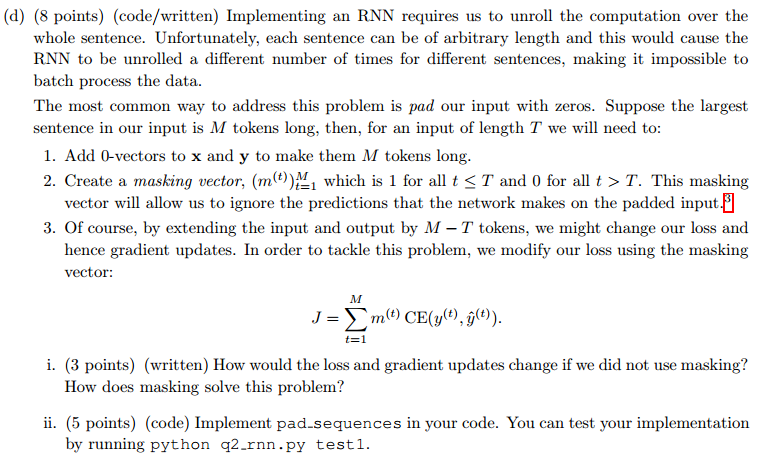 

**解：**
i) 如果不使用mask vector，对于t>T的部分，本不属于句子但算入最终的损失，但是算是增大，而这部分对应的x和y都是0，这样学习出来的模型更容易偏好y=x先这样的预测。
**后面所补的零向量所产生的损失对前面的隐藏状态的梯度更新有影响。**

ii)
```python
def pad_sequences(data, max_length):
    ret = []

    # Use this zero vector when padding sequences.
    zero_vector = [0] * Config.n_features
    zero_label = 4 # corresponds to the 'O' tag

    for sentence, labels in data:
        ### YOUR CODE HERE (~4-6 lines)
        mask = [True]*len(sentence)
        if len(sentence)>=max_length:
            sentence_pad = sentence[:max_length]
            labels_pad = labels[:max_length]
            mask_pad = mask[:max_length]
        else :
            pad_n = max_length-len(sentence)
            sentence_pad = sentence + [zero_vector]*pad_n
            labels_pad = labels + [zero_label]*pad_n
            mask_pad = mask + [False]*pad_n
        ret.append((sentence_pad,labels_pad,mask_pad))
        ### END YOUR CODE ###
    return ret
```

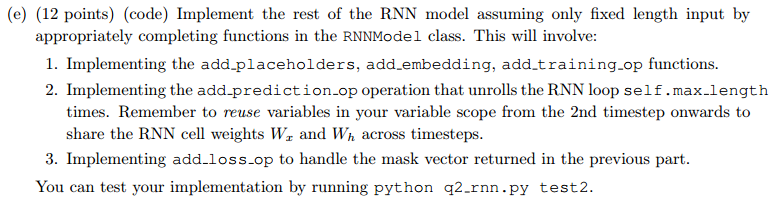 
```python
def add_placeholders(self):
    ### YOUR CODE HERE (~4-6 lines)
    self.input_placeholder = tf.placeholder(tf.int32,[None,self.max_length,self.config.n_features],name='input')
    self.labels_placeholder =tf.placeholder(tf.int32,[None,self.max_length],name='label')
    self.mask_placeholder =  tf.placeholder(tf.bool,[None,self.max_length],name='mask')
    self.dropout_placeholder=tf.placeholder(tf.float32,name='dropout')
    ### END YOUR CODE
```

```python
def add_embedding(self):
    ### YOUR CODE HERE (~4-6 lines)
    #注意要使用预训练的词向量
    embed = tf.Variable(self.pretrained_embeddings)
    embeddings = tf.nn.embedding_lookup(embed,self.input_placeholder)
    embeddings = tf.reshape(embeddings,[-1,self.max_length,self.config.n_features*self.config.embed_size])
    ### END YOUR CODE
    return embeddings
```

```python
def add_training_op(self, loss):
    ### YOUR CODE HERE (~1-2 lines)
    train_op = tf.train.AdamOptimizer(self.config.lr).minimize(loss)
    ### END YOUR CODE
    return train_op
```

```python
def add_prediction_op(self):
    x = self.add_embedding()
        dropout_rate = self.dropout_placeholder

    preds = [] # Predicted output at each timestep should go here!

    # Use the cell defined below. For Q2, we will just be using the
    # RNNCell you defined, but for Q3, we will run this code again
    # with a GRU cell!
    if self.config.cell == "rnn":
        cell = RNNCell(Config.n_features * Config.embed_size, Config.hidden_size)
    elif self.config.cell == "gru":
        cell = GRUCell(Config.n_features * Config.embed_size, Config.hidden_size)
    else:
        raise ValueError("Unsuppported cell type: " + self.config.cell)

    # Define U and b2 as variables.
    # Initialize state as vector of zeros.
    ### YOUR CODE HERE (~4-6 lines)
    with tf.variable_scope('output'):
        U = tf.get_variable('U',[self.config.hidden_size,self.config.n_classes],
                            initializer=tf.contrib.layers.xavier_initializer())
        b2= tf.get_variable('b2',[self.config.n_classes],
                            initializer=tf.constant_initializer(0))
    """
    初始化h0,h0的shape的最后一维很明显是hidden_size,而第一维应该是batch_size,
    但这里并不写死，然后而是根据x的shape的第一维来确定batch_size的大小
    """
    x_shape = tf.shape(x)
    new_state = tf.zeros((x_shape[0],self.config.hidden_size))
    ### END YOUR CODE

    with tf.variable_scope("RNN"):
        """
        1.首先，我们要进行RNN模型的训练就需要定义RNN模型的cell，也就是q2_rnn_cell.py中RNNCell类
            的实例(这在269-272行已经定义过了)
        2.先回顾一下，我们在q2_rnn_cell的__call__(input,state,scope)中定义了W_h,W_x和b
            并且variable_scope(scope)，所以，在第一次调用cell的时候，程序会创建scope的变量命名空间，
            之后再次调用的时候应该tf.get_variable_scope().reuse_variables()来重用之前定义的变量，
            也就是不能重复定义新的W_h,W_x和b。
        3.定义常量h_0作为起始隐藏状态，注意是常量，不能训练的那种。
        4.其他的按223-223行计算即可，把输出append进preds中
        """
        for time_step in range(self.max_length):
            ### YOUR CODE HERE (~6-10 lines)
            if time_step>0:
                tf.get_variable_scope().reuse_variables()
            #o_t, h_t = cell(x_t, h_{t-1})
            #这里的x[:,time_step,:]，第一个:代表取一个batch的全部数据，time_step指定第几个word，
            #最后一个:代表取这个批次的全部特征。即：取整个batch的第time_step个word的特征
            output_state,new_state = cell(x[:,time_step,:],new_state,'rnn-hidden')
            #o_drop_t = Dropout(o_t, dropout_rate)
            output_dropout = tf.nn.dropout(output_state,keep_prob=dropout_rate)
            #y_t = o_drop_t U + b_2
            y_t = tf.matmul(output_dropout,U)+b2
            preds.append(y_t)
            ### END YOUR CODE

    # Make sure to reshape @preds here.
    ### YOUR CODE HERE (~2-4 lines)
    """
    先来推算一下preds的形状：preds是个list，长度为self.max_length，每一个元素一个batch的输出，
    故每一个元素的形状为[batch_size,n_classes]，故preds的形状为[max_length,batch_size,n_classes]
    """
    #改成了tf.stack，不用tf.pack了
    #https://blog.csdn.net/qq_33655521/article/details/83750546
    preds = tf.stack(preds,axis=1)
    ### END YOUR CODE

    assert preds.get_shape().as_list() == [None, self.max_length, self.config.n_classes], "predictions are not of the right shape. Expected {}, got {}".format([None, self.max_length, self.config.n_classes], preds.get_shape().as_list())
    return preds
```

```python
def add_loss_op(self, preds):
    ### YOUR CODE HERE (~2-4 lines)
    """
    我们可以根据mask取出真正的preds和labels，然后再向往常那样计算交叉熵
    """
    mask_preds = tf.boolean_mask(preds,self.mask_placeholder)
    mask_label = tf.boolean_mask(self.labels_placeholder,self.mask_placeholder)
    loss = tf.reduce_mean(tf.nn.sparse_softmax_cross_entropy_with_logits(labels=mask_label,logits=mask_preds))
    # preds_,labels= [],[]
    # pred_shape = tf.size(preds)
    # print(pred_shape.eval())
    # print(pred_shape[0].eval())
    # for i in range(tf.to_int32(pred_shape[0])):
    #     batch_data = preds[i]
    #     #查看一个batch数据的第i个样本，这句话中每一个单词(下标为j)
    #     preds_.append([batch_data[j] for j in range(self.max_length) if self.mask_placeholder[i][j]==True])
    #     labels.append([self.labels_placeholder[i][j] for j in range(self.max_length) if self.mask_placeholder[i][j]==True])
    # loss = tf.nn.sparse_softmax_cross_entropy_with_logits(labels=labels,logits=preds_)
    # loss = tf.reduce_mean(loss)
    ### END YOUR CODE
    return loss
```

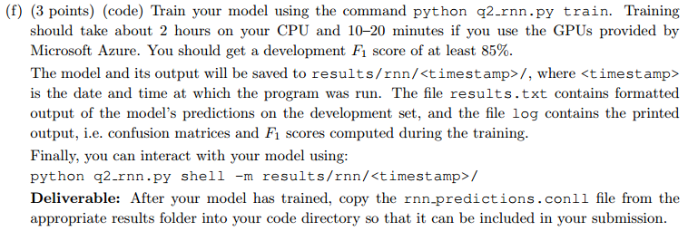  

**结果：**
```
DEBUG:Token-level confusion matrix:
go\gu   	PER     	ORG     	LOC     	MISC    	O
PER     	2968.00 	26.00   	75.00   	10.00   	70.00
ORG     	111.00  	1663.00 	99.00   	81.00   	138.00
LOC     	27.00   	66.00   	1938.00 	22.00   	41.00
MISC    	32.00   	33.00   	47.00   	1054.00 	102.00
O       	34.00   	36.00   	22.00   	30.00   	42637.00

DEBUG:Token-level scores:
label	acc  	prec 	rec  	f1
PER  	0.99 	0.94 	0.94 	0.94
ORG  	0.99 	0.91 	0.79 	0.85
LOC  	0.99 	0.89 	0.93 	0.91
MISC 	0.99 	0.88 	0.83 	0.86
O    	0.99 	0.99 	1.00 	0.99
micro	0.99 	0.98 	0.98 	0.98
macro	0.99 	0.92 	0.90 	0.91
not-O	0.99 	0.91 	0.89 	0.90

INFO:Entity level P/R/F1: 0.85/0.86/0.86
```

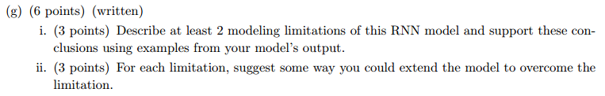  

**解：**
i) ① 句子太长，容易梯度消失；  
 ② 无法利用后文信息来决策。

ii) ① 加入GRU门控单元；  
   ② 利用双向的RNN，即biRNN。

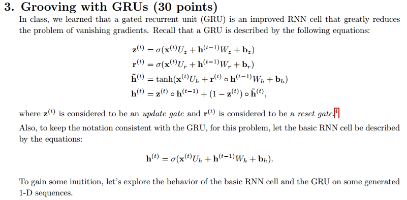  

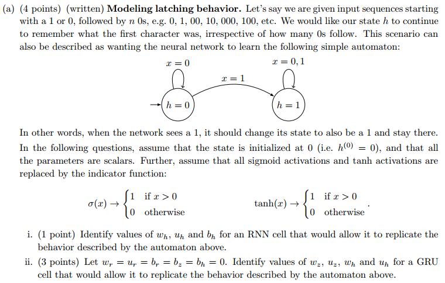  

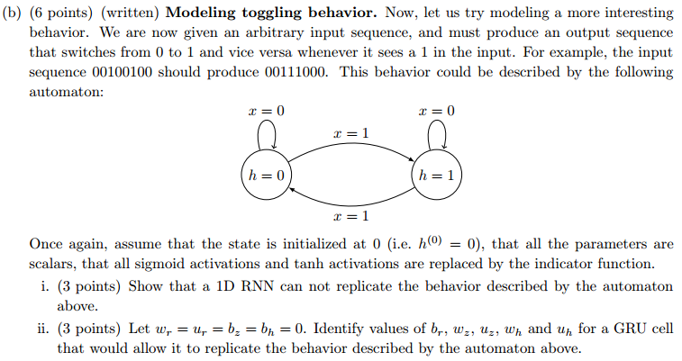  

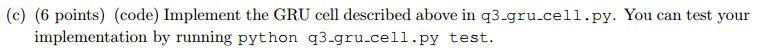  

```python
def __call__(self, inputs, state, scope=None):
    """Updates the state using the previous @state and @inputs.
    Remember the GRU equations are:

    z_t = sigmoid(x_t U_z + h_{t-1} W_z + b_z)
    r_t = sigmoid(x_t U_r + h_{t-1} W_r + b_r)
    o_t = tanh(x_t U_o + r_t * h_{t-1} W_o + b_o)
    h_t = z_t * h_{t-1} + (1 - z_t) * o_t

    TODO: In the code below, implement an GRU cell using @inputs
    (x_t above) and the state (h_{t-1} above).
        - Define W_r, U_r, b_r, W_z, U_z, b_z and W_o, U_o, b_o to
            be variables of the apporiate shape using the
            `tf.get_variable' functions.
        - Compute z, r, o and @new_state (h_t) defined above
    Tips:
        - Remember to initialize your matrices using the xavier
            initialization as before.
    Args:
        inputs: is the input vector of size [None, self.input_size]
        state: is the previous state vector of size [None, self.state_size]
        scope: is the name of the scope to be used when defining the variables inside.
    Returns:
        a pair of the output vector and the new state vector.
    """
    scope = scope or type(self).__name__

    # It's always a good idea to scope variables in functions lest they
    # be defined elsewhere!
    """
    z_t = sigmoid(x_t U_z + h_{t-1} W_z + b_z)
    r_t = sigmoid(x_t U_r + h_{t-1} W_r + b_r)
    o_t = tanh(x_t U_o + r_t * h_{t-1} W_o + b_o)
    h_t = z_t * h_{t-1} + (1 - z_t) * o_t
    """
    with tf.variable_scope(scope):
        ### YOUR CODE HERE (~20-30 lines)
        W_z = tf.get_variable('W_z',[self._state_size,self._state_size],dtype=tf.float32,
                                initializer=tf.contrib.layers.xavier_initializer())
        U_z = tf.get_variable('U_z',[self.input_size,self._state_size],dtype=tf.float32,
                                initializer=tf.contrib.layers.xavier_initializer())
        b_z = tf.get_variable('b_z',[self._state_size],dtype=tf.float32,
                                initializer=tf.constant_initializer(0))
        W_r = tf.get_variable('W_r',[self._state_size,self._state_size],dtype=tf.float32,
                                initializer=tf.contrib.layers.xavier_initializer())
        U_r = tf.get_variable('U_r',[self.input_size,self._state_size],dtype=tf.float32,
                                initializer=tf.contrib.layers.xavier_initializer())
        b_r = tf.get_variable('b_r',[self._state_size],dtype=tf.float32,
                                initializer=tf.constant_initializer(0))
        W_o = tf.get_variable('W_o',[self._state_size,self._state_size],dtype=tf.float32,
                                initializer=tf.contrib.layers.xavier_initializer())
        U_o = tf.get_variable('U_o',[self.input_size,self._state_size],dtype=tf.float32,
                                initializer=tf.contrib.layers.xavier_initializer())
        b_o = tf.get_variable('b_o',[self._state_size],dtype=tf.float32,
                                initializer=tf.constant_initializer(0))

        #更新门
        z_t = tf.nn.sigmoid(tf.matmul(inputs,U_z)+tf.matmul(state,W_z)+b_z)
        #重置门
        r_t = tf.nn.sigmoid(tf.matmul(inputs,U_r)+tf.matmul(state,W_r)+b_r)
        #候选状态
        h_  = tf.nn.tanh(tf.matmul(inputs,U_o)+tf.matmul(r_t*state,W_o)+b_o)
        new_state = tf.multiply(z_t,state)+tf.multiply(1-z_t,h_)
        ### END YOUR CODE ###
    # For a GRU, the output and state are the same (N.B. this isn't true
    # for an LSTM, though we aren't using one of those in our
    # assignment)
    output = new_state
    return output, new_state
```

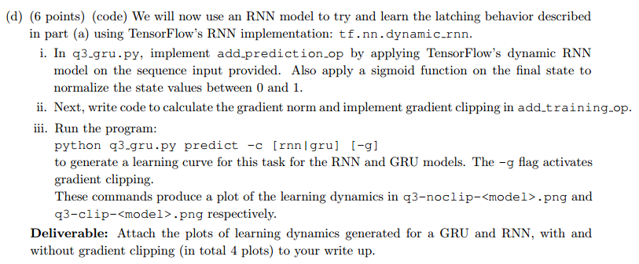  

```python
def add_prediction_op(self): 
    """Runs an rnn on the input using TensorFlows's
    @tf.nn.dynamic_rnn function, and returns the final state as a prediction.

    TODO: 
        - Call tf.nn.dynamic_rnn using @cell below. See:
            https://www.tensorflow.org/api_docs/python/nn/recurrent_neural_networks
        - Apply a sigmoid transformation on the final state to
            normalize the inputs between 0 and 1.

    Returns:
        preds: tf.Tensor of shape (batch_size, 1)
    """

    # Pick out the cell to use here.
    if self.config.cell == "rnn":
        cell = RNNCell(1, 1)
    elif self.config.cell == "gru":
        cell = GRUCell(1, 1)
    elif self.config.cell == "lstm":
        cell = tf.nn.rnn_cell.LSTMCell(1)
    else:
        raise ValueError("Unsupported cell type.")

    x = self.inputs_placeholder
    ### YOUR CODE HERE (~2-3 lines)
    preds = tf.nn.dynamic_rnn(cell,x,dtype=tf.float32)[1]
    preds = tf.nn.sigmoid(preds)
    ### END YOUR CODE

    return preds #state # preds
```

```python
def add_training_op(self, loss):
    optimizer = tf.train.GradientDescentOptimizer(learning_rate=self.config.lr)
    ### YOUR CODE HERE (~6-10 lines)
    # - Remember to clip gradients only if self.config.clip_gradients
    # is True.
    # - Remember to set self.grad_norm
    grad_and_var = optimizer.compute_gradients(loss)
    gradients = [item[0] for item in grad_and_var]
    variables = [item[1] for item in grad_and_var]
    if self.config.clip_gradients:
        clipped_grad = tf.clip_by_global_norm(gradients,clip_norm=self.config.max_grad_norm)[0]
        gradients = clipped_grad

    grad_and_var = list(zip(gradients,variables))
    self.grad_norm = gradients
    train_op = optimizer.apply_gradients(grad_and_var)
    ### END YOUR CODE

    assert self.grad_norm is not None, "grad_norm was not set properly!"
    return train_op
```

**RNN**

  
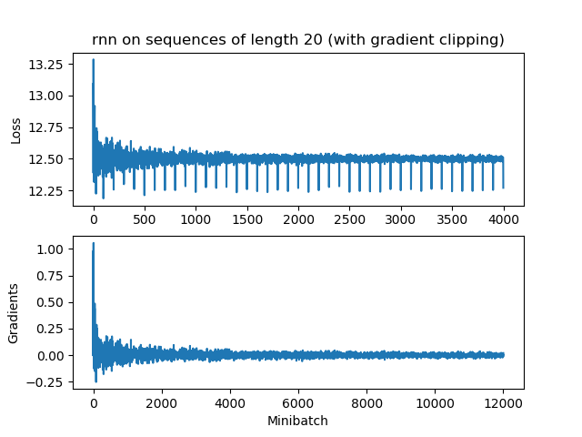  

**GRU**

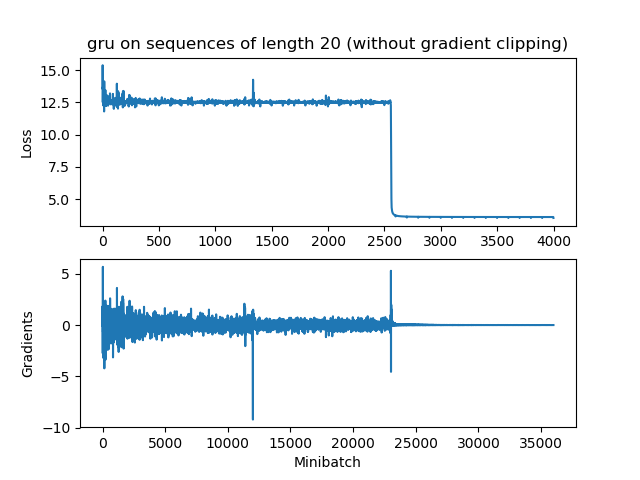  
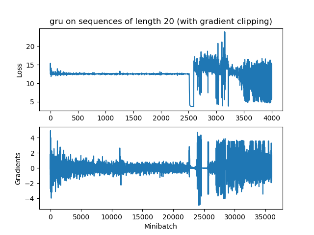  


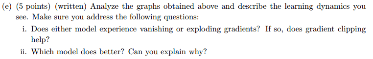  

**解：**

i) `rnn`和`GRU`都会梯度消失，但是`rnn`消失的更快一些，因此`梯度裁剪`也不会有帮助。  

ii) `GRU`可以有效防止梯度消失.

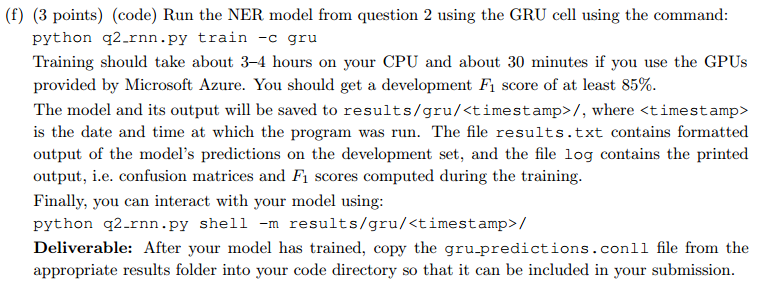  

**结果**

```
DEBUG:Token-level confusion matrix:
go\gu           PER             ORG             LOC             MISC            O
PER             2998.00         20.00           17.00           24.00           90.00
ORG             140.00          1639.00         75.00           108.00          130.00
LOC             59.00           82.00           1868.00         39.00           46.00
MISC            42.00           21.00           31.00           1045.00         129.00
O               26.00           42.00           9.00            37.00           42645.00

DEBUG:Token-level scores:
label   acc     prec    rec     f1
PER     0.99    0.92    0.95    0.93
ORG     0.99    0.91    0.78    0.84
LOC     0.99    0.93    0.89    0.91
MISC    0.99    0.83    0.82    0.83
O       0.99    0.99    1.00    0.99
micro   0.99    0.98    0.98    0.98
macro   0.99    0.92    0.89    0.90
not-O   0.99    0.91    0.88    0.89

INFO:Entity level P/R/F1: 0.85/0.86/0.86
```

