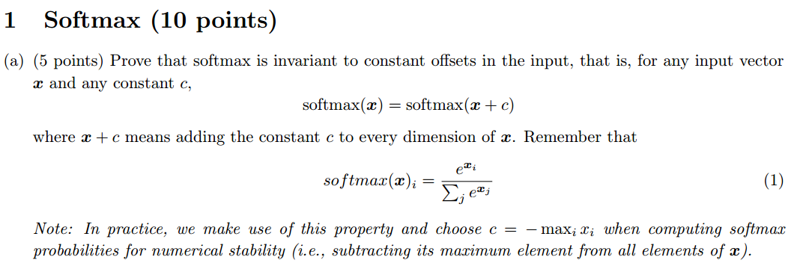
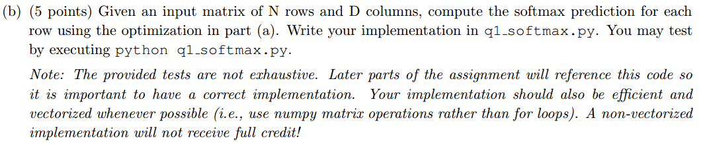
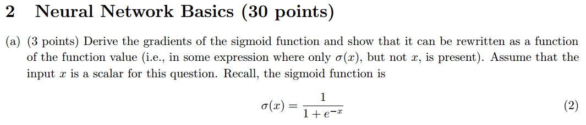
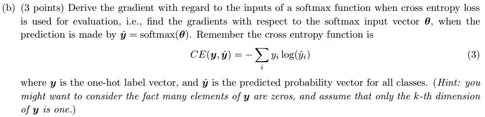
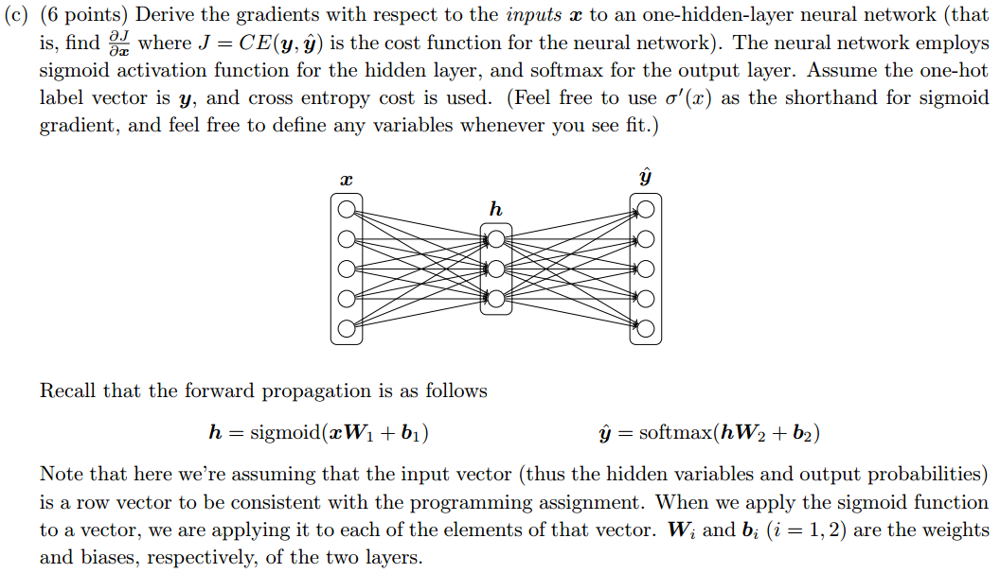
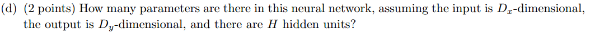
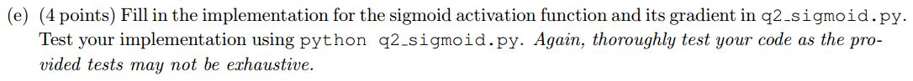
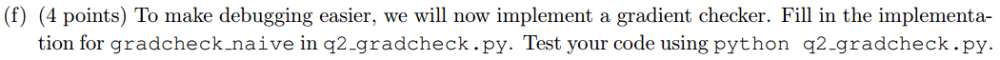
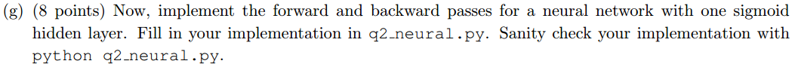

$$ Assignment\#1-solution $$  

  
  
解答：
$$ softmax(\mathbf{x})_i=\frac{e^{x_i}}{\sum_{j}{e^{x_j}}}=\frac{e^ce^{x_i}}{e^c\sum_{j}{e^{x_j}}}=\frac{e^{x_i+c}}{\sum_{j}{e^{x_j+c}}}=softmax(\mathbf{x}+c)_i $$  
即  
$$ softmax(\mathbf{x})=softmax(\mathbf{x}+c) $$  
证毕  

  

解答：  
直接在代码中利用numpy实现即可。注意要先从$x$中减去每一行的最大值，这样在保证结果不变的情况下，所有的元素不大于0，不会出现`上溢出`，从而保证结果的正确性。具体可参考 http://www.hankcs.com/ml/computing-log-sum-exp.html  
  
   

解答：
$$ \sigma'(x)=\frac{e^{-x}}{(1+e^{-x})^2}=\frac{1}{1+e^{-x}}\cdot\frac{e^{-x}}{1+e^{-x}}=\sigma(x)\cdot(1-\sigma(x)) $$  

即$sigmoid$函数的求导可以由其本身来表示。

  

解答：  
我们知道真实标记$y$是one-hot向量，因此我们下面的推导都基于 $y_k=1$ ,且 $y_i=0,i\neq k$ ，即真实标记是 $k$ .  

$$ \frac{\partial CE(y,\hat{y})}{\partial\theta}=\frac{\partial CE(y,\hat{y})}{\partial\hat{y}}\cdot\frac{\partial\hat{y}}{\partial\theta} $$  

其中：  
$$ \frac{\partial CE(y,\hat{y})}{\partial\hat{y}}=-\sum_{i}{\frac{y_i}{\hat{y}_i}}=-\frac{1}{\hat{y}_k} $$  

接下来讨论 $\frac{\partial\hat{y}}{\partial\theta}$ :  
1) $i=k$:  
$$ \frac{\partial\hat{y}}{\partial\theta_k}=\frac{\partial}{\partial\theta_k}(\frac{e^{\theta_k}}{\sum_{j}{e^{\theta_j}}})=\hat{y}_k\cdot(1-\hat{y}_k) $$  

则：  
$$ \frac{\partial CE}{\theta_i}=\frac{\partial CE}{\partial\hat{y}}\frac{\partial\hat{y}}{\theta_i}=-\frac{1}{\hat{y}_k}\cdot\hat{y}_k\cdot(1-\hat{y}_k)=\hat{y}_i-1 $$

2) $i \neq k$:  
$$ \frac{\partial\hat{y}}{\partial\theta_i}=\frac{\partial}{\partial\theta_i}(\frac{e^{\theta_k}}{\sum_{j}{e^{\theta_j}}})=-\hat{y}_i\cdot\hat{y}_k $$  

则：  
$$ \frac{\partial CE}{\theta_i}=\frac{\partial CE}{\partial\hat{y}}\frac{\partial\hat{y}}{\theta_i}=-\frac{1}{\hat{y}_k}\cdot(-\hat{y}_i\cdot\hat{y}_k)=\hat{y}_i $$  

综上：  
$$ \frac{\partial CE(y,\hat{y})}{\partial\theta_i}=\begin{cases} \hat{y}_i-1 & i=k \\ \hat{y} & i\neq k \end{cases} $$  

或者：

$$ \frac{\partial CE(y,\hat{y})}{\partial\theta_i}=\hat{y}-y $$  

  

解答：  
首先设：$Z_1=xW_1+b_1$ 和 $Z_2=hW_2+b_2$，那么前向传播的顺序依次为：  

$$ Z_1=xW_1+b_1 $$
$$ h=sigmoid(Z_1) $$
$$ Z_2=hW_2+b_2 $$
$$ \hat{y}=softmax(Z_2) $$
$$ J=CE(y,\hat{y})=-\sum_{i}{y_ilog(\hat{y}_i)} $$

现在求$\frac{\partial J}{\partial x}$其实就是进行一次反向传播：  
$$ \delta_1 =\frac{\partial J}{\partial Z_2}=\hat{y}-y $$
$$ \delta_2 =\frac{\partial J}{\partial Z_2}\cdot\frac{\partial Z_2}{\partial h}=(\hat{y}-y)\cdot\frac{\partial}{\partial x}(hW_2+b_2)=\delta_1\cdot W_2^T $$
$$ \delta_3 =\frac{\partial J}{\partial Z_2}\cdot\frac{\partial Z_2}{\partial h}\cdot\frac{\partial h}{\partial Z_1}=\delta_2\cdot\frac{\partial (\sigma(Z_1))}{\partial Z_1}=\delta_2\odot\sigma'(Z_1) $$
$$ \frac{\partial J}{\partial x} =\frac{\partial J}{\partial Z_2}\cdot\frac{\partial Z_2}{\partial h}\cdot\frac{\partial h}{\partial Z_1}\cdot\frac{\partial Z_1}{\partial x}=\delta_3\cdot\frac{\partial }{\partial x}(xW_1+b_1)=\delta_3\cdot W_1^T $$

  

解答：  
(1) 从输入层到隐藏层，全连接共$D_x\times H$个，即$W_1$，加上$H$个偏置项，共$D_x\times H+H$个。  
(2) 从隐藏层到输出层，共$H\times D_y+D_y$个。  
参数个数共：
$$ (D_x\times H+H)+(H\times D_y+D_y) $$

  

  

  