$$ Assignment\#1 -solution\quad By\ Jonariguez$$  

所有的代码题目对应的代码可查看对应文件夹Assignment2_Code下的.py文件  


**解:**  
（提示使用keepdims参数会方便一些哦。  ）

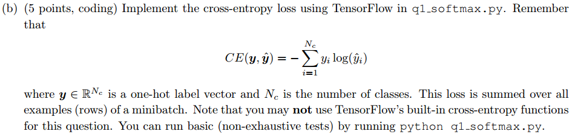

**解:**  
（积累知识：  
* tf.multiply()为元素级的乘法，要求形状相同。  
* tf.matmul()为矩阵乘法。  
两者都要求两个矩阵的元素类型必须相同。    

） 

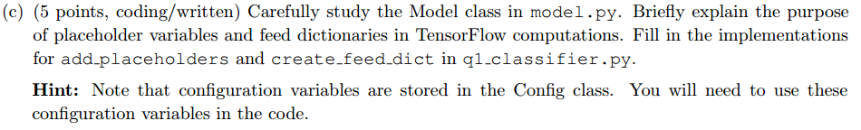  

**解:**  
占位符(placeholder)和feed_dict可以在运行时动态地向计算图“喂”数据。（TensorFlow采用的是静态图）  

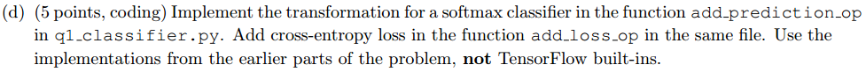  

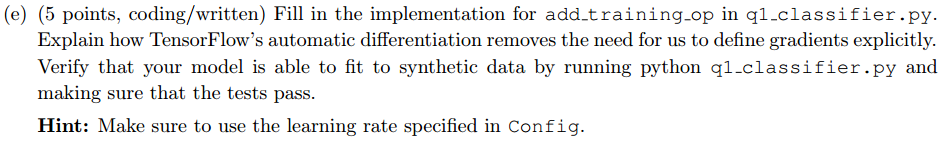  

**解:**  
TensorFlow的自动梯度，是指我们使用时只需要定义图的就好了，不用自己实现自动梯度，反向传播和求导由TensorFlow自动完成。  
  

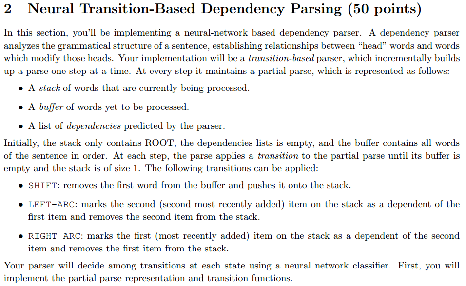  

  
**解：**  

|stack|buffer|new dependency|transition|
|-----|------|--------------|----------|
|[ROOT,parsed,this]|[sentence,correctly]| |SHIFT|
|[ROOT,parsed,this,sentence]|[correctly]| |SHIFT|
|[ROOT,parsed,sentence]|[correctly]|sentence -> this |LEFT-ARC|
|[ROOT,parsed]|[correctly]|parsed -> sentence |RIGHT-ARC|
|[ROOT,parsed,correctly]|[]| |SHIFT|
|[ROOT,parsed]|[]|parsed -> correctly |RIGHT-ARC|
|[ROOT]|[]|ROOT -> parsed |RIGHT-ARC|  
  

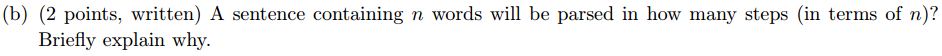  
**解：**  
共2n步  
* 每个次都要进入stack中，故要有n步SHIFT操作。  
* 最终stack中只剩ROOT，即每一次ARC会从stack中删掉一个词，故共有n步LEFT-ARC和RIGHT-ARC操作。  

   
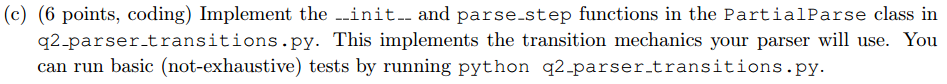  

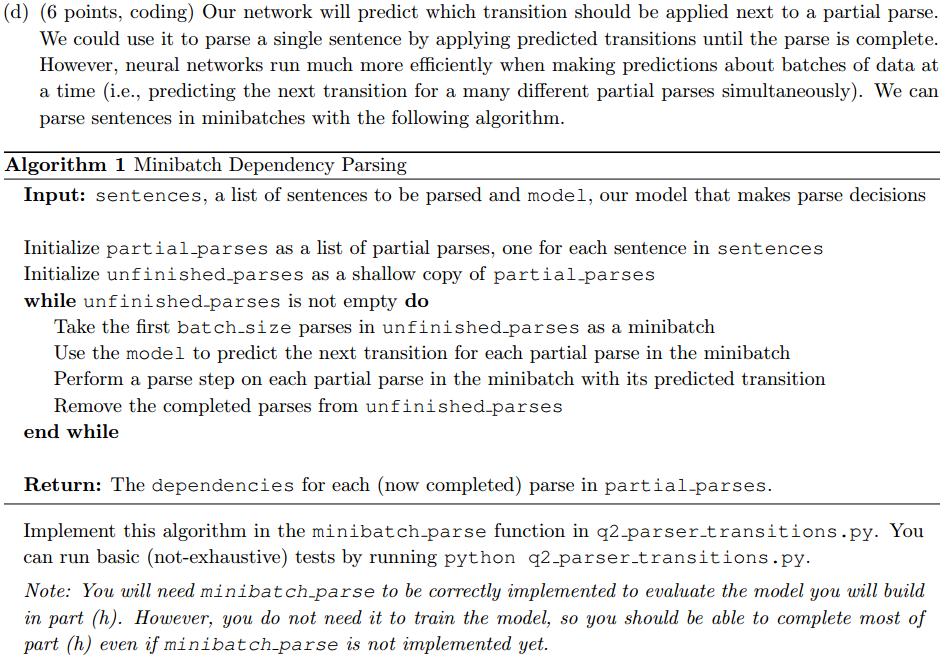  

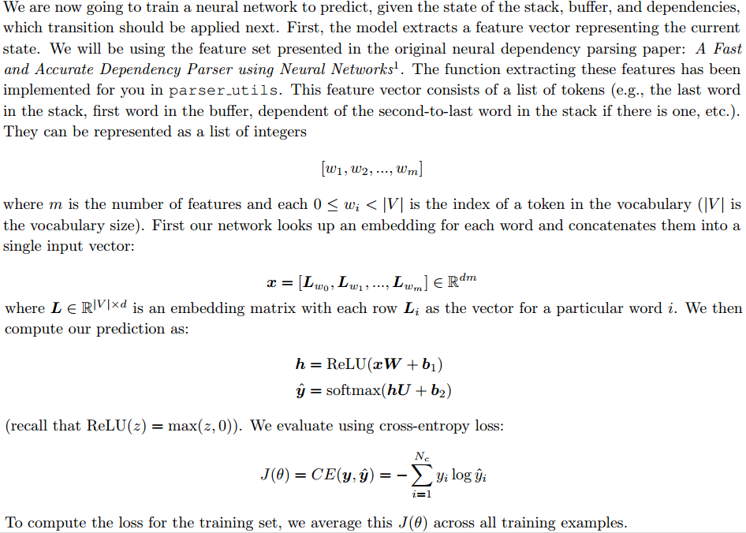  

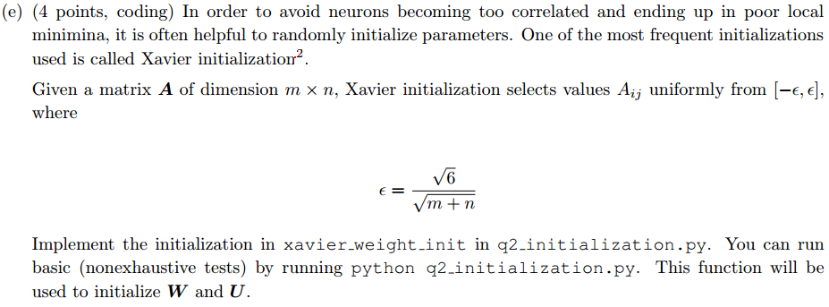

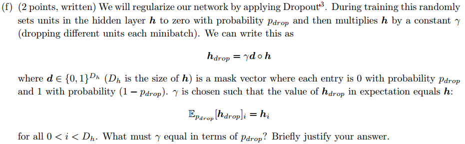
**解：**
$$ \mathbb{E}_{p_{drop}}[\mathbf{h}_{drop}]=\mathbb{E}_{p_{drop}}[\gamma \mathbf{d}\circ \mathbf{h}]=p_{drop}\cdot \vec{0}+(1-p_{drop})\cdot\gamma\cdot\mathbf{h}=\mathbf{h} $$  
即推导出：  
$$ \gamma=\frac{1}{1-p_{drop}} $$  

  

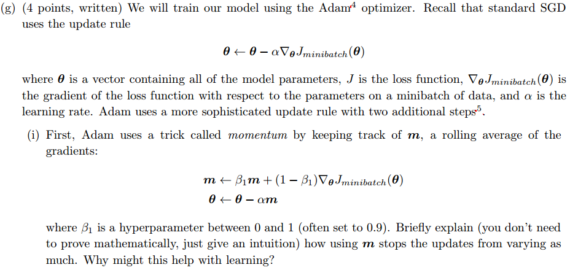  

**解:**  
因为其实$\mathbf{m}$是之前全部梯度(更新量)的加权平均，更能体现梯度的整体变化。因为这样减小了更新量的方差，避免了梯度振荡。  
$\mathbf{\beta_1}$一般要接近1。  

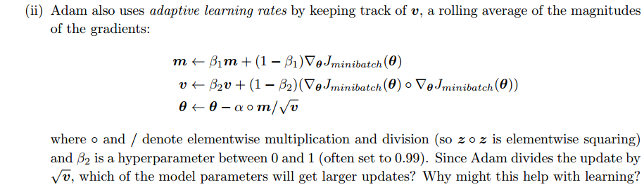  
**解：**  
* 更新量$\mathbf{m}$: 对梯度(更新量)进行滑动平均  
* 学习率$\mathbf{v}$: 对梯度的平方进行滑动平均  

梯度平均最小的参数的更新量最大，也就是说，在损失函数相对于它们的梯度很小的时候也能快速收敛。即在平缓的地方也能快递移动到最优解。  

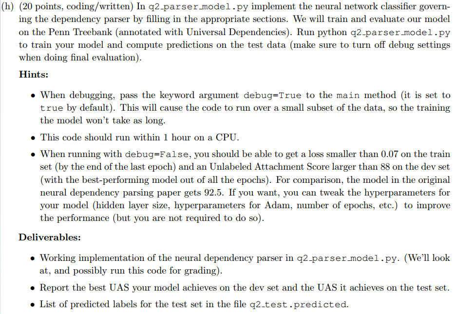  
**解：**  
我的结果为  
```
Epoch 10 out of 10
924/924 [============================>.] - ETA: 0s - train loss: 0.0654
Evaluating on dev set - dev UAS: 88.37
New best dev UAS! Saving model in ./data/weights/parser.weights

===========================================================================
TESTING
===========================================================================
Restoring the best model weights found on the dev set
Final evaluation on test set
- test UAS: 88.84
```
运行时间：15分钟。  


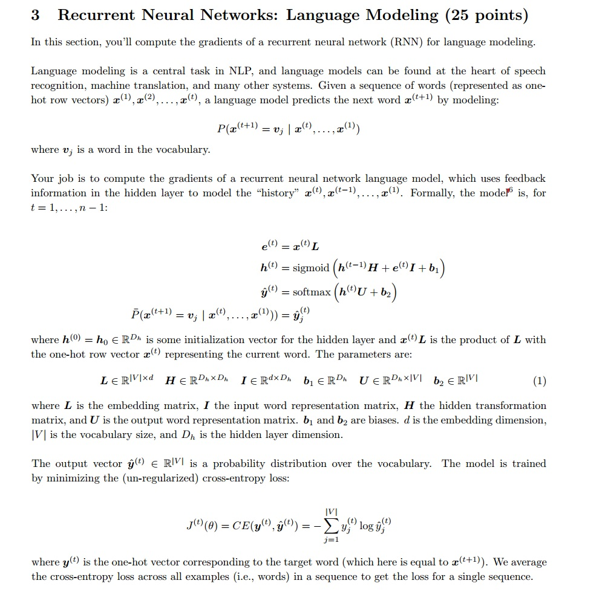
**题目解读**  
先明确题目中各个量的维度：  
由题目可知，$x^{(t)}$是one-hot**行向量**，且**隐藏层也是行向量的形式**。  
则可得：  
$$ x^{(t)}\in \mathbb{R}^{1\times |V|} $$  
$$ h^{(t)}\in \mathbb{R}^{1\times D_h} $$  

$\hat{y}^{(t)}$是输出，即每个单词的概率分布(softmax之后)，那么：  
$$ \hat{y}^{(t)}\in \mathbb{R}^{1\times |V|} $$  
然后我们就可以得到：  
$$ L\in \mathbb{R}^{|V|\times d} $$  
$$ e^{(t)}\in \mathbb{R}^{1\times d} $$  
$$ I\in \mathbb{R}^{d\times D_h} $$  
$$ H\in \mathbb{R}^{D_h\times D_h} $$  
$$ b_1\in \mathbb{R}^{1\times D_h} $$  
$$ U\in \mathbb{R}^{D_h\times |V|} $$  
$$ b_2\in \mathbb{R}^{1\times |V|} $$  

其中$d$是词向量的长度，也就是代码中的$embed\_size$。  
在清楚了上面各矩阵的维度之后的求导才会更清晰。  

因为句子的长度不一，然后损失函数是针对一个单词所计算的，然后求和之后是对整个句子的损失，故要对损失函数求平均以得到每个单词的平均损失才行。  

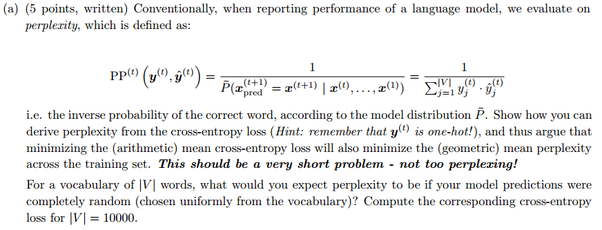  
**解：**  
由于标签$y^{t}$是one-hot向量，假设$y^{t}$的真实标记为$k$  
则：  
$$ J^{(t)}(\theta)=CE(y^{(t)},\hat{y}^{(t)})=-log\ \hat{y}_k^{(t)}=log\ \frac{1}{\hat{y}_k^{(t)}} $$  
$$ PP^{(t)}(y^{(t)},\hat{y}^{(t)})=\frac{1}{\hat{y}_k^{(t)}} $$  
很容易得出：  
$$ CE(y^{(t)},\hat{y}^{(t)})=log\ PP^{(t)}(y^{(t)},\hat{y}^{(t)}) $$  

很常见的结论，一定要知道的。  

当$|V|=10000$时，随机选择能选对的概率为$\frac{1}{|V|}=\frac{1}{10000}$，$perplexity$(困惑度)为$\frac{1}{\frac{1}{|V|}}=10000$。$CE=log10000\thickapprox 9.21$。  

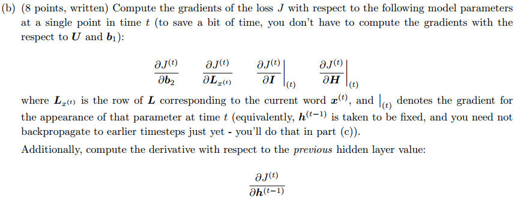  
**解：**  
根据题目可知：$L_{x^{(t)}}=e^{(t)}$。  
现在设：  
$$ v^{(t)}=h^{(t-1)}H+e^{(t)}I+b_1 $$  
$$ \theta^{(t)}=h^{(t)}U+b_2 $$  

则前向传播为：  
$$ e^{(t)}=x^{(t)}L $$  
$$ v^{(t)}=h^{(t-1)}H+e^{(t)}I+b_1 $$  
$$ h^{(t)}=sigmoid(v^{(t)}) $$  
$$ \theta^{(t)}=h^{(t)}U+b_2 $$  
$$ \hat{y}^{(t)}=softmax(\theta^{(t)}) $$  
$$ J^{(t)}=CE(y^{(t)},\hat{y}^{(t)}) $$  

反向传播：  
中间值：  
$$ \delta_1^{(t)}=\frac{\partial J^{(t)}}{\partial \theta^{(t)}}=\hat{y}^{(t)}-y^{(t)} $$  
$$ \delta_2^{(t)}=\frac{\partial J^{(t)}}{\partial v^{(t)}}=\frac{\partial J^{(t)}}{\partial \theta^{(t)}}\cdot\frac{\partial \theta^{(t)}}{\partial h^{(t)}}\cdot\frac{\partial h^{(t)}}{\partial v^{(t)}}=(\hat{y}^{(t)}-y^{(t)})\cdot U^{T}\circ h^{(t)}\circ (1-h^{(t)}) $$  

则有：  
$$ \frac{\partial J^{(t)}}{\partial b_2}=\frac{\partial J^{(t)}}{\partial \theta^{(t)}}\cdot\frac{\partial \theta^{(t)}}{\partial b_2}=\delta_1^{(t)} $$  
$$ \frac{\partial J^{(t)}}{\partial H}\rvert_t = \frac{\partial J^{(t)}}{\partial v^{(t)}}\frac{\partial v^{(t)}}{\partial H}\rvert_t=(h^{(t-1)})^T\cdot\delta_2^{(t)} $$  

$$ \frac{\partial J^{(t)}}{\partial I}\rvert_t = \frac{\partial J^{(t)}}{\partial v^{(t)}}\frac{\partial v^{(t)}}{\partial I}\rvert_t=(e^{(t)})^T\cdot\delta_2^{(t)} $$  
$$ \frac{\partial J^{(t)}}{\partial L_{x^{(t)}}} =\frac{\partial J^{(t)}}{\partial e^{(t)}}= \frac{\partial J^{(t)}}{\partial v^{(t)}}\cdot \frac{\partial v^{(t)}}{\partial e^{(t)}}=\delta_2^{(t)}\cdot I^T $$  

$$ \frac{\partial J^{(t)}}{\partial h^{(t-1)}}= \frac{\partial J^{(t)}}{\partial v^{(t)}}\cdot \frac{\partial v^{(t)}}{\partial h^{(t-1)}}=\delta_2^{(t)}\cdot H^T $$  

**如果你对上面的反向传播中的求导有疑惑，那么请看下面的简单讲解**  

考虑如下求导：  
$$ \frac{\partial J}{\partial x}=\frac{\partial J}{\partial u_1}\frac{\partial u_1}{\partial u_2}\cdot\cdot\cdot\cdot\frac{\partial u_{m}}{\partial v}\frac{\partial v}{\partial x} $$  
假设除了$\frac{\partial v}{\partial x}$，前面的已经求出了  
$$ \frac{\partial J}{\partial u_1}\frac{\partial u_1}{\partial u_2}\cdot\cdot\cdot\cdot\frac{\partial u_{m}}{\partial v}=\delta $$  
现在就差$\frac{\partial v}{\partial x}$了。需要讨论两种情况：  
1. $v$是一个行向量$r$乘上一个矩阵$x$，然后对矩阵$x$求导：  
$$ \frac{\partial }{\partial x}(rx) $$  
结果为$r^T$**左乘**前面一坨的求导结果$\delta$，即：
$$ \frac{\partial J}{\partial x}=r^T\cdot\delta $$  
而具体到题目中就是：  
$$ \frac{\partial J^{(t)}}{\partial v^{(t)}}=\delta_2^{(t)} $$  
$$ \frac{\partial v^{(t)}}{\partial H}=\frac{\partial }{\partial H}(h^{(t-1)}H+e^{(t)}I+b_1)=\frac{\partial }{\partial H}(h^{(t-1)}H)=(h^{(t-1)})^T $$  
所以：  
$$ \frac{\partial J^{(t)}}{\partial H}\rvert_t=\frac{\partial J^{(t)}}{\partial v^{(t)}}\frac{\partial v^{(t)}}{\partial H}\rvert_t=(h^{(t-1)})^T\cdot\delta_2^{(t)} $$  

2. $v$是一个行向量$r$乘上一个矩阵$x$，然后对行向量$r$求导：  
$$ \frac{\partial }{\partial r}(rx) $$  
结果为$x^T$**右乘**前面一坨的求导结果$\delta$，即： 
$$ \frac{\partial J}{\partial x}=\delta\cdot x^T $$  
而具体到题目中就是：
$$ \frac{\partial J^{(t)}}{\partial h^{(t-1)}}= \frac{\partial J^{(t)}}{\partial v^{(t)}}\cdot \frac{\partial v^{(t)}}{\partial h^{(t-1)}}=\delta_2^{(t)}\cdot H^T $$  

