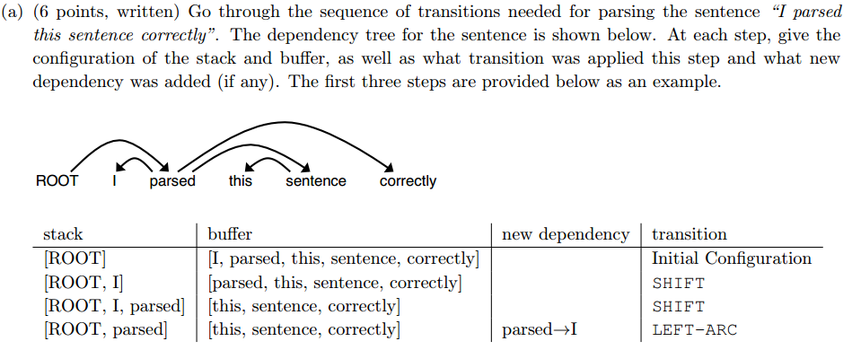

$$ Assignment\#1 -solution\quad By\ Jonariguez$$  

所有的代码题目对应的代码可查看对应文件夹Assignment2_Code下的.py文件  

**解:**  
（提示使用keepdims参数会方便一些哦。  ）

**解:**  
（积累知识：  
* tf.multiply()为元素级的乘法，要求形状相同。  
* tf.matmul()为矩阵乘法。  
两者都要求两个矩阵的元素类型必须相同。    

） 

  

**解:**  
占位符(placeholder)和feed_dict可以在运行时动态地向计算图“喂”数据。（TensorFlow采用的是静态图）  

  

  

**解:**  
TensorFlow的自动梯度，是指我们使用时只需要定义图的就好了，不用自己实现自动梯度，反向传播和求导由TensorFlow自动完成。  
  

  

  
**解：**  

|stack|buffer|new dependency|transition|
|-----|------|--------------|----------|
|[ROOT,parsed,this]|[sentence,correctly]| |SHIFT|
|[ROOT,parsed,this,sentence]|[correctly]| |SHIFT|
|[ROOT,parsed,sentence]|[correctly]|sentence -> this |LEFT-ARC|
|[ROOT,parsed]|[correctly]|parsed -> sentence |RIGHT-ARC|
|[ROOT,parsed,correctly]|[]| |SHIFT|
|[ROOT,parsed]|[]|parsed -> correctly |RIGHT-ARC|
|[ROOT]|[]|ROOT -> parsed |RIGHT-ARC|  
  

  
**解：**  
共2n步  
* 每个次都要进入stack中，故要有n步SHIFT操作。  
* 最终stack中只剩ROOT，即每一次ARC会从stack中删掉一个词，故共有n步LEFT-ARC和RIGHT-ARC操作。  

   
  

  

  

**解：**
$$ \mathbb{E}_{p_{drop}}[\mathbf{h}_{drop}]=\mathbb{E}_{p_{drop}}[\gamma \mathbf{d}\circ \mathbf{h}]=p_{drop}\cdot \vec{0}+(1-p_{drop})\cdot\gamma\cdot\mathbf{h}=\mathbf{h} $$  
即推导出：  
$$ \gamma=\frac{1}{1-p_{drop}} $$  

  

  

**解:**  
因为其实$\mathbf{m}$是之前全部梯度(更新量)的加权平均，更能体现梯度的整体变化。因为这样减小了更新量的方差，避免了梯度振荡。  
$\mathbf{\beta_1}$一般要接近1。  

  
**解：**  

