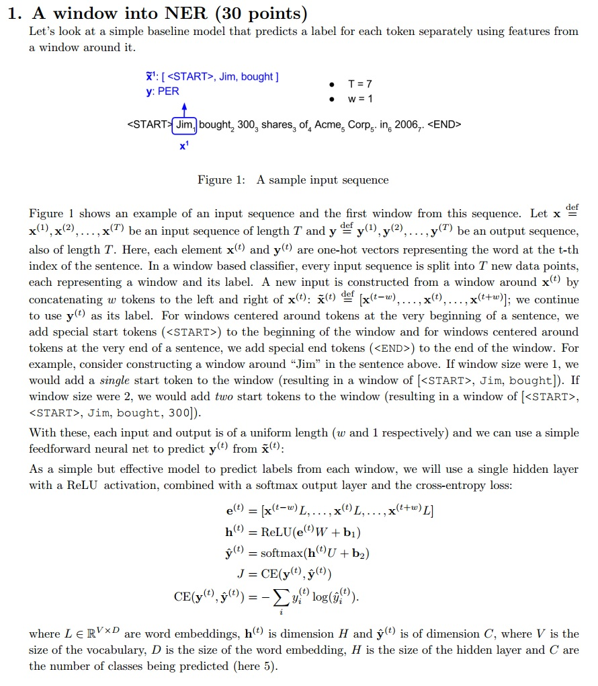
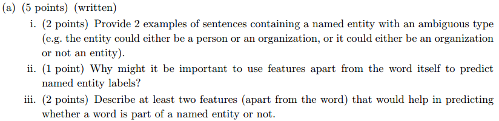
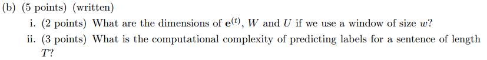
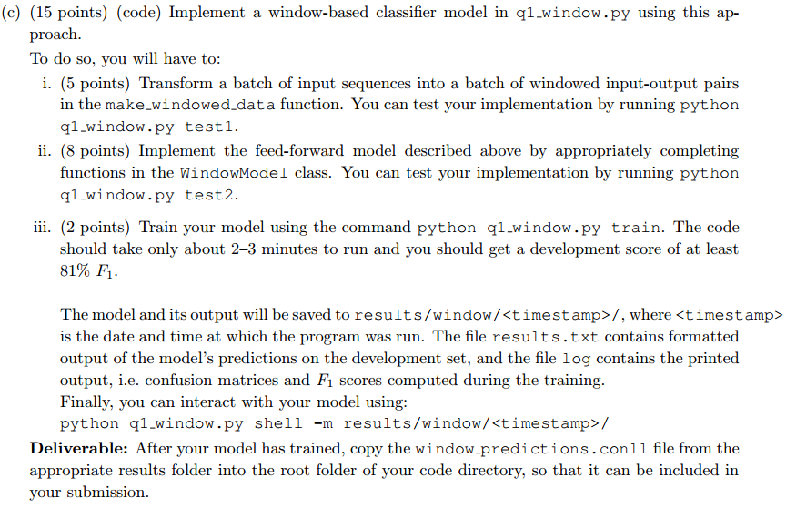
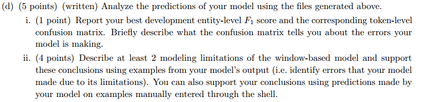

$$ Assignment\#3 -solution\quad By\ Jonariguez$$  

**所有的代码题目对应的代码可查看对应文件夹Assignment3_Code下的.py文件**  

  

  

**解：**  
ii) 只用词本身的话有点像基于统计的方法，面对低频词或者未统计词模型表现不好，有时候词也有二义性，无法确定是否为实体或者是什么实体。  
iii) 上下文、词性等。  

  

**解：**  
i) 推算所有变量的形状：  

$$ x^{(t)}\in \mathbb{R}^{1\times V} $$  
$$ x^{(t)}L\in \mathbb{R}^{1\times D} $$  
$$ e^{(t)}\in \mathbb{R}^{1\times (2w+1)D} $$  
$$ h^{(t)}\in \mathbb{R}^{1\times H} $$  
$$ W \in \mathbb{R}^{(2w+1)D\times H} $$  
$$ \hat{y}^{(t)}\in \mathbb{R}^{1\times C} $$  
$$ U\in \mathbb{R}^{H\times C} $$  
$$ b_1\in \mathbb{R}^{1\times H} $$  
$$ b_2\in \mathbb{R}^{1\times C} $$  

ii) 对于1个word的复杂度为：  

$$ e^{(t)}=[x^{(t-w)}L,...,x^{(t)}L,...,x^{(t+w)}L]\rightarrow O(wV) $$  
$$ h^{(t)}=ReLU(e^{(t)}W+b_1)\rightarrow O(wDH)$$  
$$ \hat{y}^{(t)}=softmax(h^{(t)}U+b_2)\rightarrow O(HC)$$  
$$ J=CD(y^{(t)},\hat{y}^{(t)})=-\sum_{i}{y_i^{(t)}log(\hat{y}_i^{(t)})} \rightarrow O(C)$$  

所以复杂度为：  $O(wV+wDH+HC)$  
长度为T的句子复杂度为： $O(T(wV+wDH+HC))$   

  

**解：**  

在python3中利用`from io import StringIO`来导`StringIO`。

  

