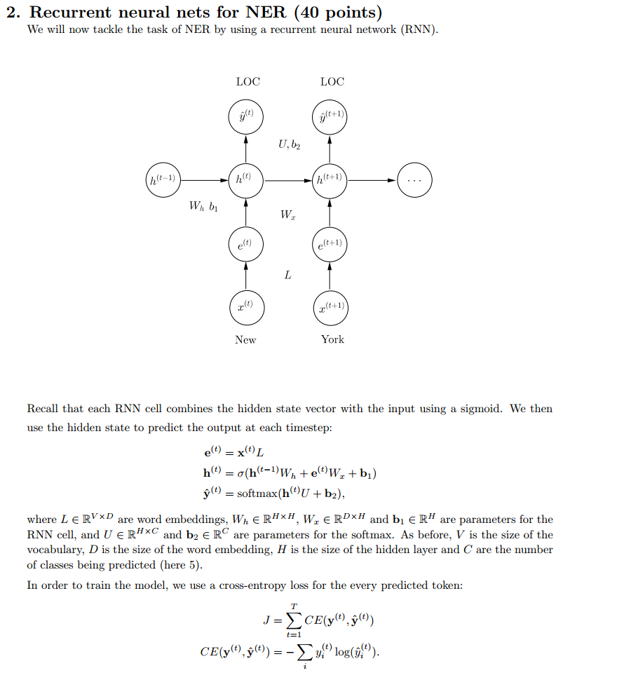
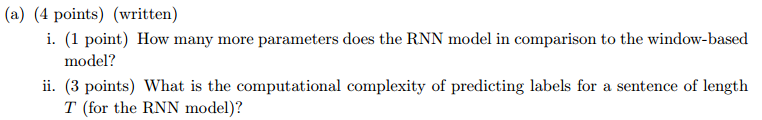
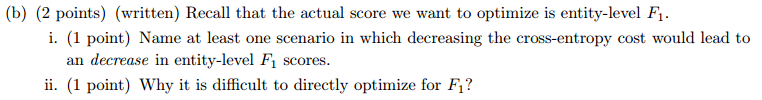
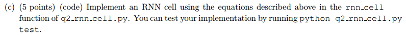
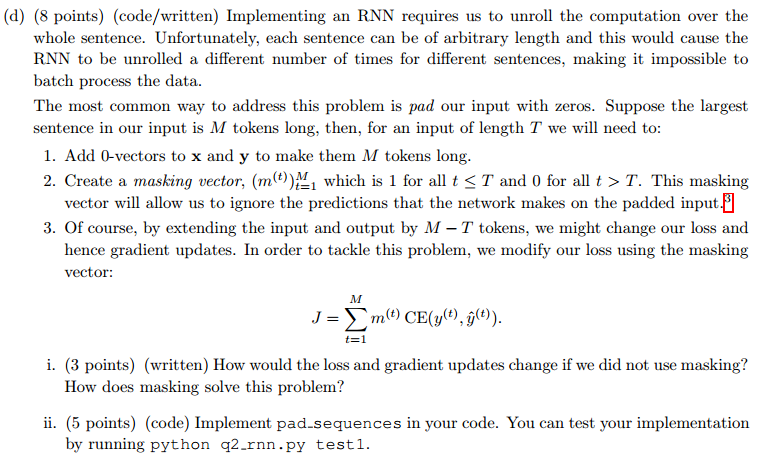
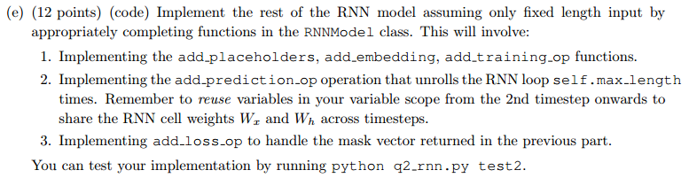
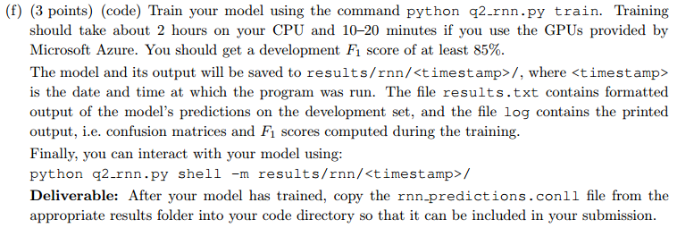

$$ Assignment\#3 -solution\quad By\ Jonariguez$$  

**所有的代码题目对应的代码可查看对应文件夹Assignment3_Code下的.py文件**  

  

  

**解：**  
ii) 只用词本身的话有点像基于统计的方法，面对低频词或者未统计词模型表现不好，有时候词也有二义性，无法确定是否为实体或者是什么实体。  
iii) 上下文、词性等。  

  

**解：**  
i) 推算所有变量的形状：  

$$ x^{(t)}\in \mathbb{R}^{1\times V} $$  
$$ x^{(t)}L\in \mathbb{R}^{1\times D} $$  
$$ e^{(t)}\in \mathbb{R}^{1\times (2w+1)D} $$  
$$ h^{(t)}\in \mathbb{R}^{1\times H} $$  
$$ W \in \mathbb{R}^{(2w+1)D\times H} $$  
$$ \hat{y}^{(t)}\in \mathbb{R}^{1\times C} $$  
$$ U\in \mathbb{R}^{H\times C} $$  
$$ b_1\in \mathbb{R}^{1\times H} $$  
$$ b_2\in \mathbb{R}^{1\times C} $$  

ii) 对于1个word的复杂度为：  

$$ e^{(t)}=[x^{(t-w)}L,...,x^{(t)}L,...,x^{(t+w)}L]\rightarrow O(wV) $$  
$$ h^{(t)}=ReLU(e^{(t)}W+b_1)\rightarrow O(wDH)$$  
$$ \hat{y}^{(t)}=softmax(h^{(t)}U+b_2)\rightarrow O(HC)$$  
$$ J=CD(y^{(t)},\hat{y}^{(t)})=-\sum_{i}{y_i^{(t)}log(\hat{y}_i^{(t)})} \rightarrow O(C)$$  

所以复杂度为：  $O(wV+wDH+HC)$  
长度为T的句子复杂度为： $O(T(wV+wDH+HC))$   

  

**解：**  

在python3中利用`from io import StringIO`来导`StringIO`。

  

 
  

  

**解：**

i) ① `window-based model`中的$W\in \mathbb{R}^{(2w+1)D\times H}$，而`RNN`中的$W_x\in \mathbb{R}^{D\times H}$;

   ② `RNN`多了个$W_h\in \mathbb{R}^{H\times H}$。

ii) $\mathcal{O}((D+H)\cdot H\cdot T)$.

  

**解：**
ii) ① $F_1$分数的意义理解起来不够明显、直接明了。

② $F_1$分数的计算需要整个语料库来计算，很难进行批训练和并行运算。

 

 

**解：**
i) 如果不使用mask vector，对于t>T的部分，本不属于句子但算入最终的损失，但是算是增大，而这部分对应的x和y都是0，这样学习出来的模型更容易偏好y=x先这样的预测。
**后面所补的零向量所产生的损失对前面的隐藏状态的梯度更新有影响。**

 

  

  

**解：**
i) ① 句子太长，容易梯度消失；  
 ② 无法利用后文信息来决策。

ii) ① 加入GRU门控单元；  
   ② 利用双向的RNN，即biRNN。